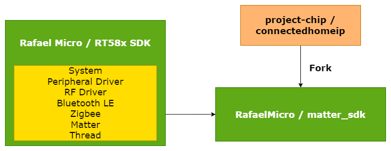
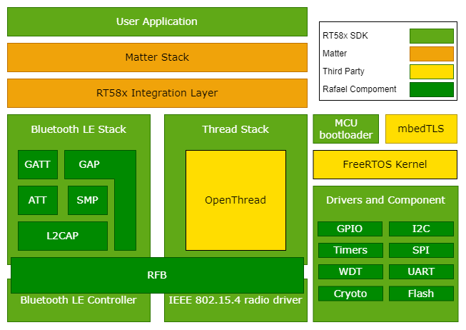

## Rafael RT58x Matter SDK

Welcome to the Rafael RT58x Matter SDK github repo. It is built on top of the [Matter open source SDK](https://github.com/project-chip/connectedhomeip/) and added related components e.g., RT58x RF library(thread/BLE), system/peripherial driver for RT58x platform. The users can use this repo to build the Matter application on their own.

## Matter stack in the RT58x SDK

The following diagram shows a simplified structure of a Matter application that
runs on the RT58x platform and uses Bluetooth® LE and Thread stacks for
communication purposes:

> **Note**: For readability, the diagram does not show all projects components,
> only the most important ones for a typical Matter application.

### RT58x SDK

The RT58x SDK is based on the [FreeRTOS](https://www.freertos.org/index.html),
which is a Real-time operating system for microcontrollers. RT58x supports
multiple hardware platforms and provides hardware drivers, application
protocols, protocol stacks, and more. The RT58x SDK also integrates other
projects like crypto library mbedTLS, MCU bootloader or the
[OpenThread](https://openthread.io/) implementation of the Thread stack.

### Thread stack

For the Thread communication purposes, the RT58x platform application is using
the Thread stack, which consists of several layers implemented in different
projects. The core of the Thread stack is [OpenThread](https://github.com/openthread/openthread), but it also requires the
IEEE 802.15.4 radio driver provided by RT58x SDK.

### Matter integration

Matter is located on the top application layer of the presented model, looking
from the networking point of view. The Bluetooth LE and Thread stacks
provided by the RT58x SDK will be integrated with the Matter stack using a
special intermediate layer.

In practice, this layer contains platform-specific implementations of abstract
manager interfaces (such as Bluetooth LE Manager or Thread Stack Manager)
defined in the Matter stack. The application is able to use Matter's platform
agnostic interfaces and no additional platform-related actions are needed to
perform communication through the Matter stack.

### Build system

The RT58x platform makes use of the following build systems to generate ninja
build scripts:

-   GN - Used by the Matter project in majority of cases.
-   CMake - Used by other components related with the RT58x platform.

As a result, Matter's stack and platform modules are built with GN and the output is used to generate the library file. The
application, RT58x SDK are built with CMake and the Matter library file is
imported during the compilation process.

Please follow the steps below to create and test a fully functional Matter
example on RT58x series of SoCs

-   Rafael(RT582/RT583) Getting Start Guide
    >The following application demo will need the specified tool providing by Rafael Micro, please go to the [Rafael Customer Support Portal](https://support.rafaelmicro.com:8088/) to download related files.
    -   [Setup Matter SDK Enviroment and Building an example application](./rafael_docs/matter_env_setup.md)
    -   Application Usage Guide
        -   [Matter over Thread Demo Overview](./rafael_docs/matter_over_thread_overview.md)
        -   [Flash the Application Image](./rafael_docs/flash_application.md)
    -   [Factory Data](./rafael_docs/Rafael_Factory_Data.md)
    -   [Matter OTA](./rafael_docs/Rafael_Software_Update.md)
-   Application development Guide
    -   [File structure](./rafael_docs/Rafael_App_File_Structure.md)
    -   [How to modify](./rafael_docs/Rafael_App_Development.md)
    -   [Where is peripheral API](./rafael_docs/Rafael_Peripheral_SDK.md)
