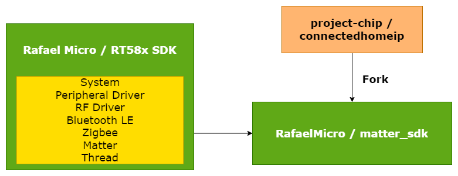
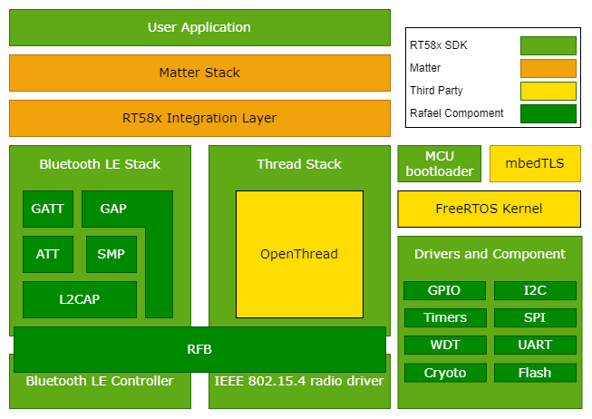

## Rafael RT58x Matter SDK

Welcome to the Rafael RT58x Matter SDK github repo. It is built on top of the [Matter open source SDK](https://github.com/project-chip/connectedhomeip/) and added related components e.g., RT58x RF library(thread/BLE), system/peripheral driver... in this repo to help the user to build the Matter application with RT58x platform.

-   Supported Rafael chips:
    -   RT583 (2MB flash)
    -   RT584L (2MB flash)
    -   RT584H (2MB flash)
    -   RT584HA4 (4MB flash, Support Matter+Zigbee dual mode)

## Matter stack in the RT58x SDK

The following diagram shows a simplified structure of a Matter application that
runs on the RT58x platform and uses Bluetooth® LE and Thread stacks for
communication purposes:

> **Note**: For readability, the diagram does not show all projects components,
> only the most important ones for a typical Matter application.

### RT58x SDK

The RT58x SDK is based on the [FreeRTOS](https://www.freertos.org/index.html),
which is a Real-time operating system for microcontrollers. RT58x supports
multiple hardware platforms and provides hardware drivers, application
protocols, protocol stacks, and more. The RT58x SDK also integrates other
projects like crypto library mbedTLS, MCU bootloader or the
[OpenThread](https://openthread.io/) implementation of the Thread stack.

### Thread stack

For the Thread communication purposes, the RT58x platform application is using
the Thread stack, which consists of several layers implemented in different
projects. The core of the Thread stack is [OpenThread](https://github.com/openthread/openthread), but it also requires the
IEEE 802.15.4 radio driver provided by RT58x SDK.

### Matter integration

Matter is located on the top application layer of the presented model, looking
from the networking point of view. The Bluetooth LE and Thread stacks
provided by the RT58x SDK will be integrated with the Matter stack using a
special intermediate layer.

In practice, this layer contains platform-specific implementations of abstract
manager interfaces (such as Bluetooth LE Manager or Thread Stack Manager)
defined in the Matter stack. The application is able to use Matter's platform
agnostic interfaces and no additional platform-related actions are needed to
perform communication through the Matter stack.

### Build system

The RT58x platform uses GN to generate ninja build scripts. Matter's stack and platform modules are built with GN, and the output is used as the library for the application build.

Please follow the steps below to create and test a fully functional Matter
example on RT58x series of SoCs

-   Rafael Getting Started Guide
    -   Setup Matter SDK Environment and Building an example application
        -   [Environment Setup Overview](./rafael_docs/matter_env_setup.md)
        -   [Linux / macOS](./rafael_docs/linux_macos_setup.md)
        -   [Windows (VSCode + WSL2)](./rafael_docs/windows_setup.md)
    -   Application Usage Guide
        -   [Flash application](./rafael_docs/flash_application.md)
        -   [Matter over Thread Overview](./rafael_docs/matter_over_thread_overview.md)
        -   [Matter Device Interoperability Testing](./rafael_docs/Matter_Application_Note.md)
    -   [Factory Data](./rafael_docs/Rafael_Factory_Data.md)
    -   [Matter OTA](./rafael_docs/Rafael_Software_Update.md)
    -   [Flash Memory Layout](./rafael_docs/Flash_Layout_Customer_Guide.md)
    -   [Debugger Setup (WSL + OpenOCD)](./rafael_docs/WSL%20Debugging%20Guide.md)
-   Application Development Guide
    -   [File structure](./rafael_docs/Rafael_App_File_Structure.md)
    -   [BLE Multi Control](./rafael_docs/Rafael_BLE_Multi_Control_Guide.md)
    -   [Rafael Submodules](./rafael_docs/Rafael_Submodules.md)
