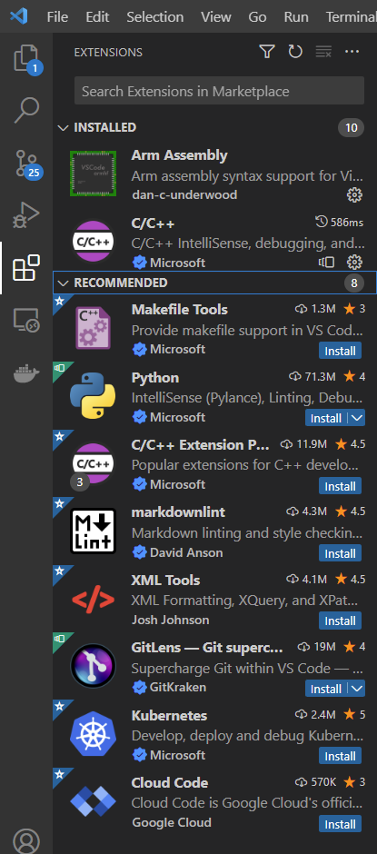

# Rafael matter environment setup for windows

## Prerequest

-   Visual Studio Code: [Download](https://code.visualstudio.com/Download)
-   Docker Desktop:
    [Download](https://desktop.docker.com/win/main/amd64/Docker%20Desktop%20Installer.exe?utm_source=docker&utm_medium=webreferral&utm_campaign=dd-smartbutton&utm_location=module)
<!-- -   Git bash: [Download](https://git-scm.com/download/win) -->

---

## Install WSL2 and setup Network

- Windows should accept WSL to access host network, so we need to setup FireWall setting with "powershell administrator"
```
$ wsl --install
$ New-NetFirewallRule -DisplayName "WSL" -Direction Inbound -InterfaceAlias "vEthernet (WSL)" -Action Allow
```

---

## Activate WSL2

- open VScode and install some extention for develop envoriment 
    - WSL (ms-vscode-remote.remote-wsl)
- Using lower left icon (like this ><) and select new WSL window
    - Now the vscode terminal will be a linux terminal (like this sw@DESKTOP-JNHERQ8:~$) 

---

## Building Matter

In WSL terminal using following command to clone project:

```
git clone --recurse-submodules https://github.com/RexhuangTW/connectedhomeip.git
```

If you already have a checkout, run the following command to sync submodules:

```
git submodule update --init
```

- In get started select "Open folder..." to open "connectedhomeip" folder 

---

## Setup environment

### Install VSCode extension

Install all recommendations tool:

-   spmeesseman.vscode-taskexplorer
-   ms-vscode.cpptools
-   ms-vscode-remote.remote-containers
-   ms-azuretools.vscode-docker
-   dan-c-underwood.arm
-   twxs.cmake
-   vadimcn.vscode-lldb
-   marus25.cortex-debug

<!--  -->

### Install VSCode extension

Run VSCode task :"RT matter dev setup" Task "RT matter dev setup" include three
sub-task:

1. "RT matter image build (Step I)"
2. "RT matter container build (Step II)"
3. "RT matter container env setup (Step III)"

<!--  -->

### Building project

Run VSCode task :"Build RT lighting example"
