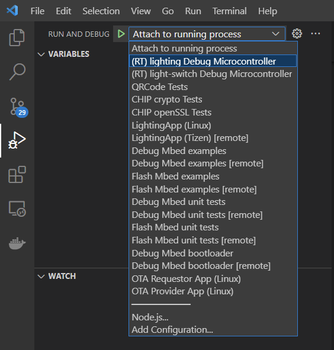

# Rafael matter environment setup for windows
## Prerequest
- SEGGER JLink: [Download](https://www.segger.com/downloads/jlink/) 
- Arm Tool chain: [Download](https://developer.arm.com/downloads/-/arm-gnu-toolchain-downloads)
---

## Setup NetWork connection between windows and WSL2
- Windows should accept WSL to access host network, so we need to setup FireWall setting with "powershell administrator"
```
$ New-NetFirewallRule -DisplayName "WSL" -Direction Inbound -InterfaceAlias "vEthernet (WSL)" -Action Allow
```
- WSL we need setup a host IP's environment variable for VScode debug scripts
    - ~/.bash_profile add following setting:
    ```
    $ export WSL_HOST_IP=$(cat /etc/resolv.conf | sed -rn 's|nameserver (.*)|\1|p')
    ```
    - ~/.bashrc add following setting:
    ```
    $ export WSL_HOST_IP=$(cat /etc/resolv.conf | sed -rn 's|nameserver (.*)|\1|p')
    ```
    - Apply those setting:
    ```
    $ source ~/.bashrc
    $ source ~/.bash_profile
    ```
    - Install some package for debugger
    ```
    $ sudo apt-get install libncurses5
    ```
    - \* Close all Vscode window, and reopen it (This action will help VScode refetch the WSL's environment values) 
---

## Setup Configure
- Add Rafael configure file to JLink:
    - Append JLinkDevices.xml and RT58x_1MB.FLM to JLink path (ex:C:\Program Files (x86)\SEGGER\JLink)
- Config VSCode debugger setup (task.json):
    - From Task launchJLink "label": "launchJLink" 
        - JLink setup : replace command <JLinkGDBServerCL.exe path>, ex: /mnt/c/Program Files (x86)/SEGGER/JLink/JLinkGDBServerCL.exe ( in WSL C:/ should change to /mnt/c/)
        
Note: This debugger's Arm Tool chain and execute file will using matter code and decker env, so you need setup matter env bofore debugger 

---
## Start Debugger

