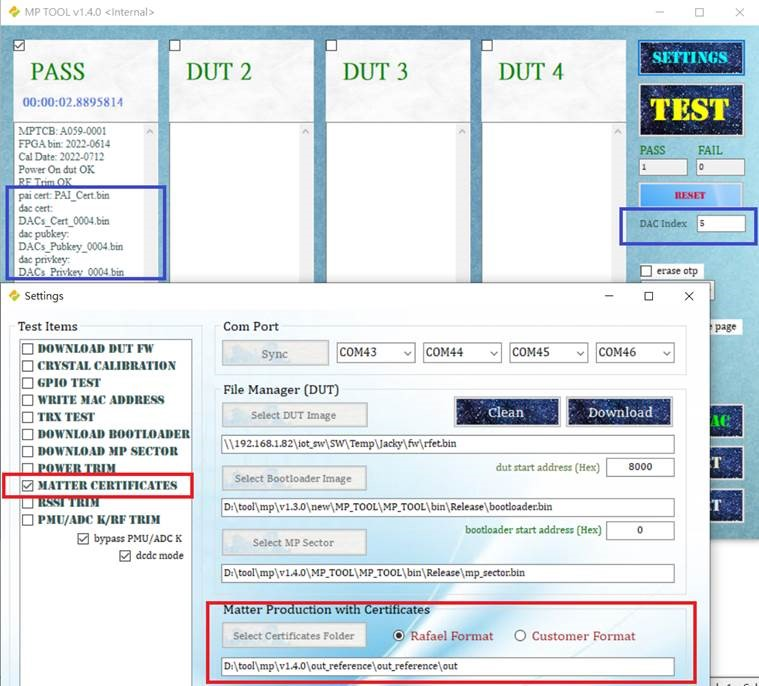

# Configuring factory data for Rafael RT583 examples

## Supported data

Rafael MP tool with MPTCB supports adding following data to RT583:

Device attestation data

- Device attestation key and certificate (DAC Keys, DAC)
- Product attestation intermediate certificate (PAI)
- Certificate declaration (CD)

## Modify device attestation data

By default applications uses default device attestation credentials provider. There are two ways to modify different device attestation data. First, you can write hardcode value in your Matter code. Second, you can use the RafaelMicro MP tool to replace device attestation data.

- Hardcoding - you need to generate device attestion data and replace following c++ files
  - DeviceAttestationCredsExample.cpp
  - ExampleDACs.cpp
  - ExamplePAI.cpp

- MP tool with MPTCB - we offer encrypted device attestaion data

## Generate Matter device attestation data
For example, we'll use Matter 's own test PAA certificate and signing key from Matter github SDK as our root certificate. We'll use it as root CA to generate our own test PAI, DAC and CD.

1. Generate the PAI certificate and key using chip-cert command

       ./chip-cert gen-att-cert --type i \
       --subject-cn "Matter Test PAI" \
       --subject-vid FFF1 \
       --valid-from "2023-02-28 15:00:00" \
       --lifetime "3650" \
       --ca-key credentials/test/attestation/Chip-Test-PAA-NoVID-Key.pem \
       --ca-cert credentials/test/attestation/Chip-Test-PAA-NoVID-Cert.pem \
       --out-key credentials/test/attestation/Chip-Test-PAI-FFF1-Key.pem \
       --out credentials/test/attestation/Chip-Test-PAI-FFF1-Cert.pem

2. Generate the DAC certificate and key using chip-cert command

       ./chip-cert gen-att-cert --type d \
       --subject-cn "Matter Test DAC" \
       --subject-vid FFF1 \
       --subject-pid 8005 \
       --valid-from "2023-02-28 15:00:00" \
       --lifetime "3650" \
       --ca-key credentials/test/attestation/Chip-Test-PAI-FFF1-Key.pem \
       --ca-cert credentials/test/attestation/Chip-Test-PAI-FFF1-Cert.pem \
       --out-key credentials/test/attestation/Chip-Test-DAC-FFF1-8005-Key.pem \
       --out credentials/test/attestation/Chip-Test-DAC-FFF1-8005-Cert.pem

3. Verify the DAC, PAI and PAA chain. If no errors appear in the output, it means the certifacate attestation chain is successfully verified

       ./chip-cert validate-att-cert \
       --dac credentials/test/attestation/Chip-Test-DAC-FFF1-8005-Cert.pem \
       --pai credentials/test/attestation/Chip-Test-PAI-FFF1-Cert.pem \
       --paa credentials/test/attestation/Chip-Test-PAA-NoVID-Cert.pem

4. You can inspect your keys using openssl command

       openssl ec -noout -text -in \
       credentials/test/attestation/Chip-Test-DAC-FFF1-8005-Key.pem

   Example output

       read EC key
       Private-Key: (256 bit)
       priv:
           c7:5c:44:87:77:43:f4:67:97:ef:b6:eb:32:2c:02:
           f5:f5:95:bb:e7:18:53:7e:4e:74:16:41:37:97:c4:
           5d:b8
       pub:
           04:ea:a2:59:91:f9:97:d9:fd:69:93:98:f6:de:54:
           c6:8c:34:14:dd:2b:80:37:b3:07:7c:a8:9c:0c:3b:
           ba:e6:38:7a:8a:a7:69:97:f4:e3:46:35:4b:2a:d7:
           77:91:b5:5d:40:9c:ee:a6:c3:ab:1b:68:7c:af:ce:
           bd:2a:bb:bf:4e
       ASN1 OID: prime256v1
       NIST CURVE: P-256
  
5. You may also use openssl command to inspect your own generated device attestion certificates

       openssl x509 -noout -text -in \
       credentials/test/attestation/Chip-Test-DAC-FFF1-8005-Cert.pem
    
    Example output

       Certificate:
          Data:
             Version: 3 (0x2)
             Serial Number: 5726215280551725601 (0x4f779a7578b30a21)
             Signature Algorithm: ecdsa-with-SHA256
             Issuer: CN = Matter Test PAI, 1.3.6.1.4.1.37244.2.1 = FFF1
             Validity
                Not Before: Feb 28 15:00:00 2023 GMT
                Not After : Feb 25 14:59:59 2033 GMT
             Subject: CN = Matter Test DAC, 1.3.6.1.4.1.37244.2.1 = FFF1, 1.3.6.1.4.1.37244.2.2 = 8005
             Subject Public Key Info:
                Public Key Algorithm: id-ecPublicKey
                   Public-Key: (256 bit)
                   pub:
                      04:ea:a2:59:91:f9:97:d9:fd:69:93:98:f6:de:54:
                      c6:8c:34:14:dd:2b:80:37:b3:07:7c:a8:9c:0c:3b:
                      ba:e6:38:7a:8a:a7:69:97:f4:e3:46:35:4b:2a:d7:
                      77:91:b5:5d:40:9c:ee:a6:c3:ab:1b:68:7c:af:ce:
                      bd:2a:bb:bf:4e
                   ASN1 OID: prime256v1
                   NIST CURVE: P-256
             X509v3 extensions:
                X509v3 Basic Constraints: critical
                   CA:FALSE
                X509v3 Key Usage: critical
                   Digital Signature
                X509v3 Subject Key Identifier: 
                   75:CB:CC:29:95:8E:00:29:39:DB:25:2C:D1:E0:75:40:33:99:97:DF
            X509v3 Authority Key Identifier: 
                   49:61:26:3E:E4:D3:DE:55:C7:B5:DE:C8:D8:C9:F2:45:E6:61:D0:4C
         Signature Algorithm: ecdsa-with-SHA256
         Signature Value:
            30:44:02:20:02:36:cf:c0:a9:c2:8b:1f:f3:01:c0:4e:ba:e1:
            05:69:bf:cd:54:c2:17:33:47:3f:4f:7c:96:47:78:18:0d:7e:
            02:20:69:04:91:a2:86:f5:67:43:0c:8c:fc:e9:85:a4:d7:08:
            fa:86:45:a5:eb:e2:40:f8:58:e6:e1:7e:25:15:f0:06

## Replace the PAI, DAC and CD

1. Convert PAI certifcate pem file to der file using following command

       ./chip-cert convert-cert credentials/test/attestation/Chip-Test-PAI-FFF1-Cert.pem credentials/test/attestation/Chip-Test-PAI-FFF1-Cert.der --x509-der

2. Generate PAI C array data using xxd command

       xxd -i credentials/test/attestation/Chip-Test-PAI-FFF1-Cert.der

3. Generate PAI public key c array data using following command

       openssl ec -text -noout -in credentials/test/attestation/Chip-Test-PAI-FFF1-Key.pem 2>/dev/null | sed '/ASN1 OID/d' | sed '/NIST CURVE/d' | sed -n '/pub:/,$p' | sed '/pub:/d' | sed 's/\([0-9a-fA-F][0-9a-fA-F]\)/0x\1/g' | sed 's/:/, /g'

4. Generate PAI private key c array data using following command

       openssl ec -text -noout -in credentials/test/attestation/Chip-Test-PAI-FFF1-Key.pem 2>/dev/null | sed '/read EC key/d' | sed '/Private-Key/d' | sed '/priv:/d' | sed '/pub:/,$d' | sed 's/\([0-9a-fA-F][0-9a-fA-F]\)/0x\1/g' | sed 's/:/, /g'

5. If you don't use Rafael MP tool with MPTCB to modify device attestaion data, you might need to replace array `const uint8_t kDevelopmentPAI_Cert_FFF1` value, `kDevelopmentPAI_PublicKey_FFF1` and `kDevelopmentPAI_PrivateKey_FFF1` in `src/credentials/examples/ExamplePAI.cpp` file

6. Convert DAC certificate pem file to der file using following command

       ./chip-cert convert-cert credentials/test/attestation/Chip-Test-DAC-FFF1-8005-Cert.pem credentials/test/attestation/Chip-Test-DAC-FFF1-8005-Cert.der --x509-der       

7. Generate DAC C array data using following command

       xxd -i credentials/test/attestation/Chip-Test-DAC-FFF1-8005-Cert.der

8. Generate DAC public key c array data using following command

       openssl ec -text -noout -in credentials/test/attestation/Chip-Test-DAC-FFF1-8005-Key.pem 2>/dev/null | sed '/ASN1 OID/d' | sed '/NIST CURVE/d' | sed -n '/pub:/,$p' | sed '/pub:/d' | sed 's/\([0-9a-fA-F][0-9a-fA-F]\)/0x\1/g' | sed 's/:/, /g'

9. Generate DAC private key c array data using following command

       openssl ec -text -noout -in credentials/test/attestation/Chip-Test-DAC-FFF1-8005-Key.pem 2>/dev/null | sed '/read EC key/d' | sed '/Private-Key/d' | sed '/priv:/d' | sed '/pub:/,$d' | sed 's/\([0-9a-fA-F][0-9a-fA-F]\)/0x\1/g' | sed 's/:/, /g'

10. If you don't use Rafael MP tool with MPTCB to modify device attestaion data, you might neet to replace array `const uint8_t kDevelopmentDAC_Cert_FFF1_8005` value, `kDevelopmentDAC_PublicKey_FFF1_8005` value and `kDevelopmentDAC_PrivateKey_FFF1_8005` value in `src/credentials/examples/ExampleDACs.cpp` file

11. Generate CD using following command

        ./chip-cert gen-cd \
        --key credentials/test/certification-declaration/Chip-Test-CD-Signing-Key.pem \
        --cert credentials/test/certification-declaration/Chip-Test-CD-Signing-Cert.pem \
        --out credentials/test/certification-declaration/Chip-Test-CD-0xFFF1-0x8005.der \
        --format-version "1" \
        --vendor-id "0xFFF1" \
        --product-id "0x8005" \
        --device-type-id "0x1234" \
        --certificate-id "ZIG20141ZB330001-24" \
        --security-level "0" \
        --security-info "0" \
        --version-number "9876" \
        --certification-type "0"

12. Generate CD c array data using following command
        
        xxd -i credentials/test/certification-declaration/Chip-Test-CD-0xFFF1-0x8005.der

13. If you don't use Rafael MP tool with MPTCB to modify device attestaion data, you might neet to replace array `const uint8_t kCdForAllExamples` value in `src/credentials/examples/DeviceAttestationCredsExample.cpp` file

## Rafael MP tool with MPTCB

For example, build lighting-app with certificates and use MP tool with MPTCB to modify device attestation

    ./scripts/examples/gn_rt582_example.sh examples/lighting-app/rt582/ out RT583 --certs=yes

First of all, RT583 has to connect with MPTCB

Furthermore, open Rafael MP tool and follow the steps to operate

1. Press `SETTINGS` button and it will pop out Settings window
2. Select `MATTER CERTIFICATES` in the left side of Settings window
3. Press `Select Certificates Folder` button and select Certifcate files
4. Close the Settings window
5. Type certificate index number in `DAC Index` field and press `TEST` button
6. If it shows PASS message, it means the certificates is successfully modified