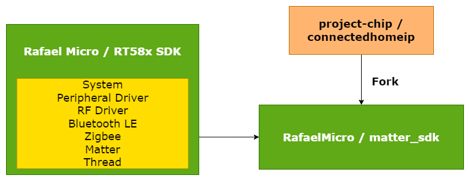
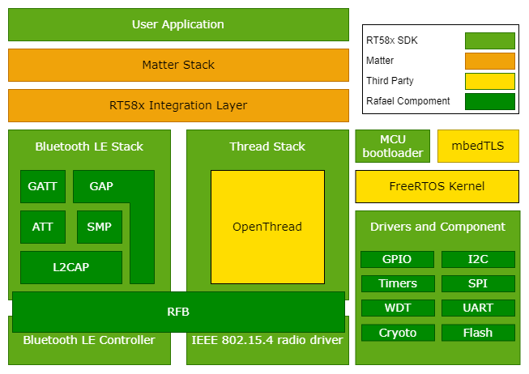
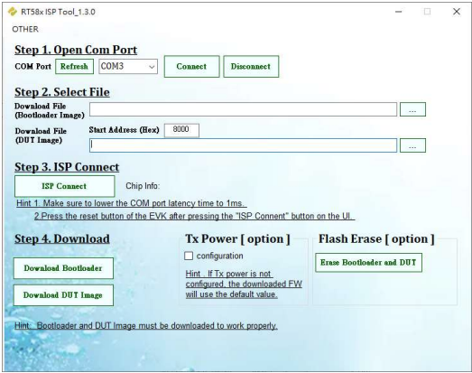
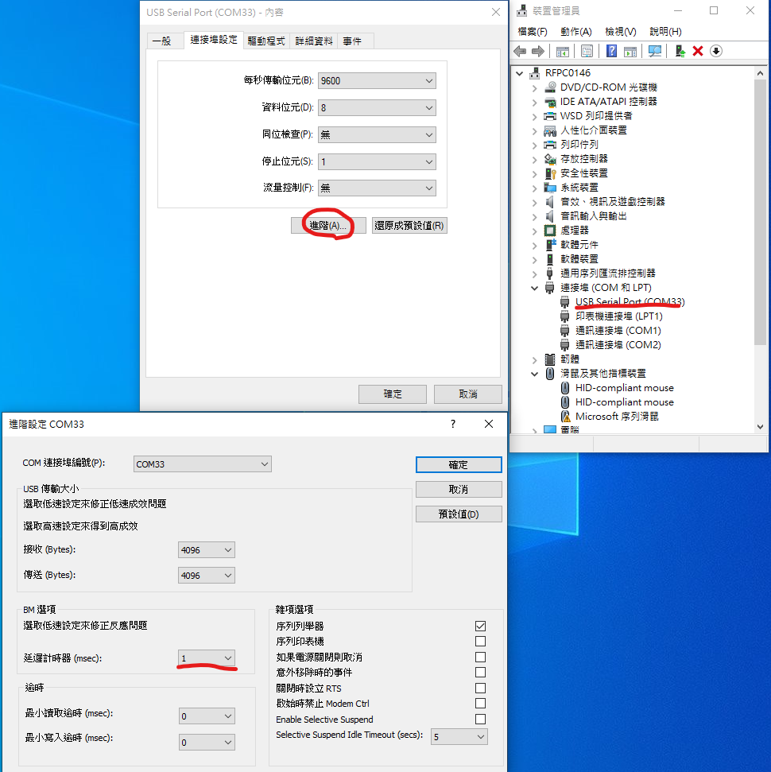
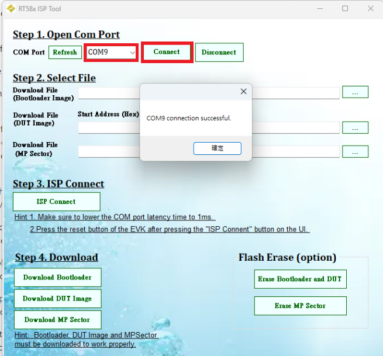
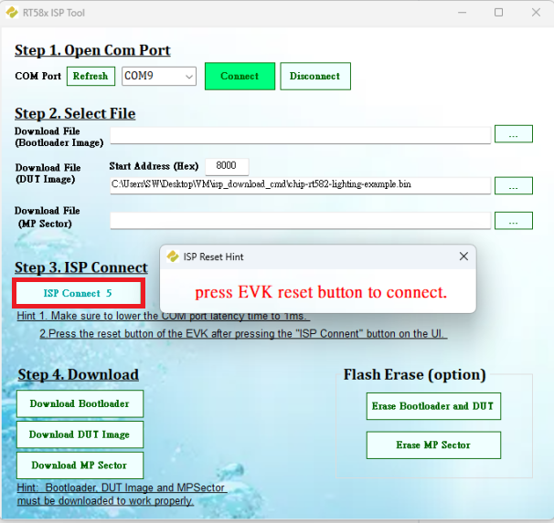
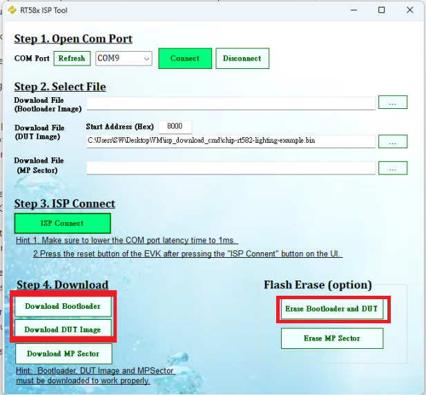

# RT58x platform overview

## Matter intergration in the RT58x SDK

Matter is included in RT58x SDK as one of the submodule repositories, using a
dedicated Matter fork. That is, the code used for the RT58x SDK and Matter
integration is stored in the Matter repository (RT58x platform) and is compiled
when building one of the available Matter samples.



<hr>

## Matter stack in the RT58x SDK

The RT58x platform is a
[Rafal Matter SDK](https://github.com/RafaelMicro/matter_sdk) platform that uses
Rafael Micro's RT58x SDK.

The following diagram shows a simplified structure of a Matter application that
runs on the nRF Connect platform and uses Bluetooth® LE and Thread stacks for
communication purposes:



> **Note**: For readability, the diagram does not show all projects components,
> only the most important ones for a typical Matter application.

<hr>

### RT58x SDK

The RT58x SDK is based around [FreeRTOS](https://www.freertos.org/index.html),
which is a Real-time operating system for microcontrollers. RT58x supports
multiple hardware platforms and provides hardware drivers, application
protocols, protocol stacks, and more. The RT58x SDK also integrates other
projects like crypto library mbedTLS, MCU bootloader or the
[OpenThread](https://openthread.io/) implementation of the Thread stack.

<hr>

### Thread stack

For the Thread communication purposes, the RT58x platform application is using
the Thread stack, which consists of several layers implemented in different
projects. The core of the Thread stack is OpenThread, but it also requires the
IEEE 802.15.4 radio driver provided by RT58x SDK.

<hr>

### Matter integration

Matter is located on the top application layer of the presented model, looking
from the networking point of view. The Bluetooth LE and Thread or Wi-Fi stacks
provided by the RT58x SDK must be integrated with the Matter stack using a
special intermediate layer.

In practice, this layer contains platform-specific implementations of abstract
manager interfaces (such as Bluetooth LE Manager or Thread Stack Manager)
defined in the Matter stack. The application is able to use Matter's platform
agnostic interfaces and no additional platform-related actions are needed to
perform communication through the Matter stack.

<hr>

### Build system

The RT58x platform makes use of the following build systems to generate ninja
build scripts:

-   GN - Used by the Matter project in majority of cases.
-   CMake - Used by other components related with the RT58x platform.

As a result, Matter's stack and platform modules are built with GN (see the
overview diagram) and the output is used to generate the library file. The
application, RT58x SDK are built with CMake and the Matter library file is
imported during the compilation process.

<hr>

Please follow the steps below to create and test a fully functional Matter
example on RT58x series of SoCs

-   [Rafael(RT582/RT583) Getting Start Guide]()
    -   [Setup Matter SDK Enviroment and Building an example application]()
    -   [Application Usage Guide]()
        -   [Flash application]()
        -   [Commissioning]()
    -   [Factory Data](rafael_factory_data.md)
    -   [Matter OTA](rafael_software_update.md)
-   [Application development Guide]()
    -   [File structure]()
    -   [How to modify]()
    -   [Where is peripheral API]()

<hr>

## Rafael(RT582/RT583) Getting Start Guide

## Setup Matter SDK Enviroment and Building an example application

-   Supported Rafael chips:
    -   RT583 (2MB flash, Support Matter OTA)
    -   RT582 (1MB flash, Unsupport Matter OTA)
-   Support development platfrom:
    1. MacOS and Linux (Ubuntu: require version 22.04),
       [Document](./linux_macos_setup.md)
    2. Windows (WSL2 integrate) with VSCode and Docker,
       [Document](./windows_setup.md)

<hr>

## Application Usage Guide

### Flash Application

The RT58x In System Program (ISP) tool, which packaged in Rafael IoT Evaluation
Tool.



Flash code step:

1. Setup COM port:



2. Connect device:



3. Select bootloader and DUT bin file


4. Setup EVK to ISP mode (clicked reser buttom)



5. Erase and download image



<hr>

### Commissioning

Using CHIP Tool for Matter device testing, Setup step:

1.  **Prepare the Rafael Matter device**
2.  **Enable Bluetooth LE advertising on Matter device**: Examples are
    configured to advertise automatically on boot.
3.  **Make sure the IP network is set up**: To follow the next steps, the IP
    network must be up and running.
4.  **Determine network pairing credentials** Get Thread network credentials:
    ```
    $ sudo ot-ctl dataset active -x
    0e080000000000010000000300001335060004001fffe002084fe76e9a8b5edaf50708fde46f999f0698e20510d47f5027a414ffeebaefa92285cc84fa030f4f70656e5468726561642d653439630102e49c0410b92f8c7fbb4f9f3e08492ee3915fbd2f0c0402a0fff8
    Done
    ```
5.  **Determine Matter device’s discriminator and setup PIN code**: This device
    **discriminator** is `3840` and **PIN code** is `20202021` (default)
6.  **Commission Matter device into existing IP network**: Commissioning into
    Thread network over Bluetooth LE: To commission the device to the existing
    Thread network, use the following command pattern:
    ```
    $ chip-tool pairing ble-thread <node_id> hex:<operational_dataset> <pin_code> <discriminator>
    ```
    > <node_id> is the user-defined ID of the node being commissioned.
    > <operational_dataset> is the Operational Dataset determined in the step 4.
    > <pin_code> and <discriminator are device-specific keys determined in the
    > step 5.
7.  **Control application Data Model clusters** Use the following command
    pattern to toggle the Matter Light state:
    ```
    $ chip-tool onoff toggle <node_id> <endpoint_id>
    ```
    > <node_id> is the user-defined ID of the commissioned node. <endpoint_id>
    > is the ID of the endpoint with OnOff cluster implemented.
