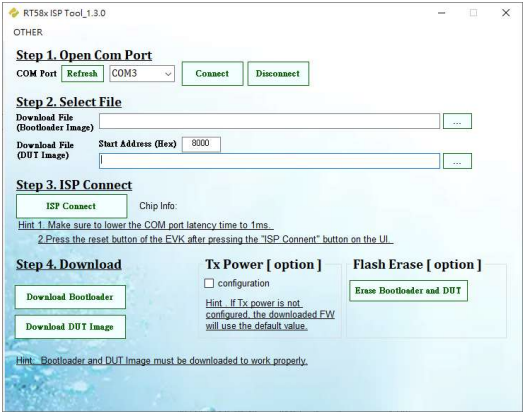
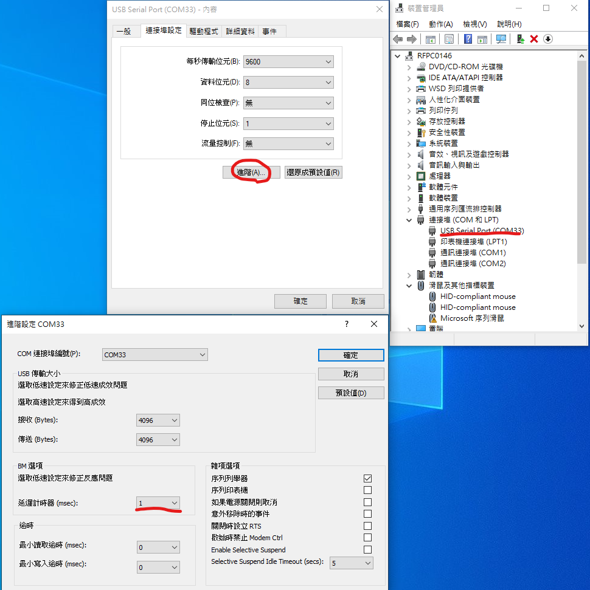
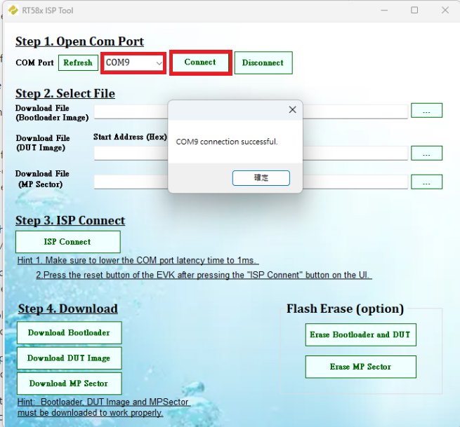

# Flash Application

The RT58x In System Program (ISP) tool, which packaged in Rafael IoT Evaluation
Tool.

Flash code step:

1. Setup COM port:

2. Connect device:

3. Select bootloader and DUT bin file

4. Setup EVK to ISP mode (clicked reser buttom)

5. Erase and download image

