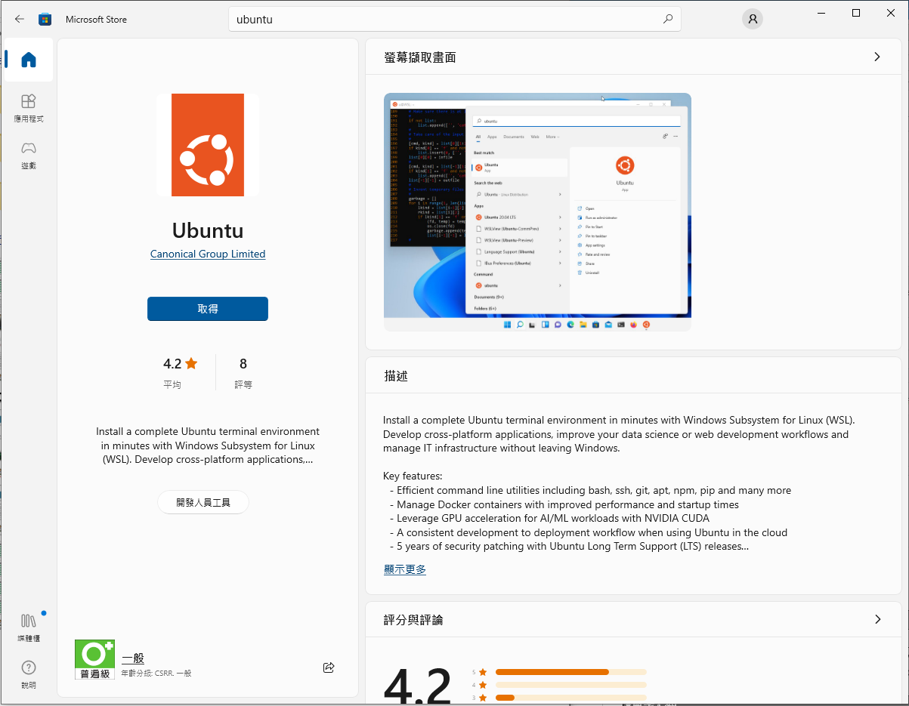
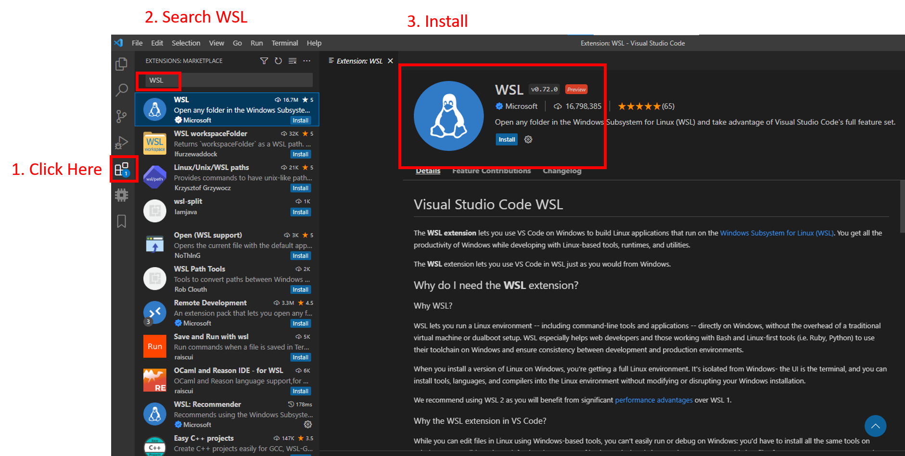
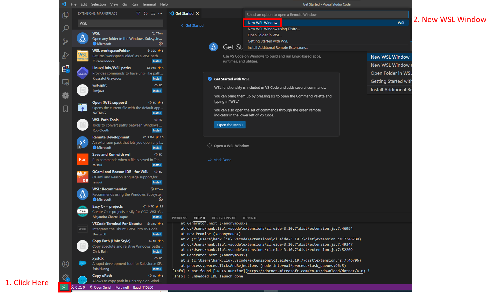
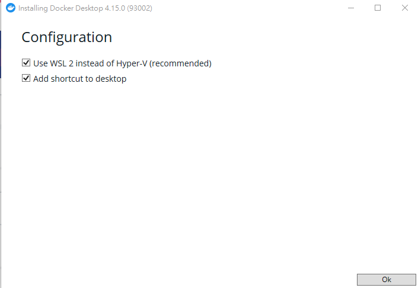
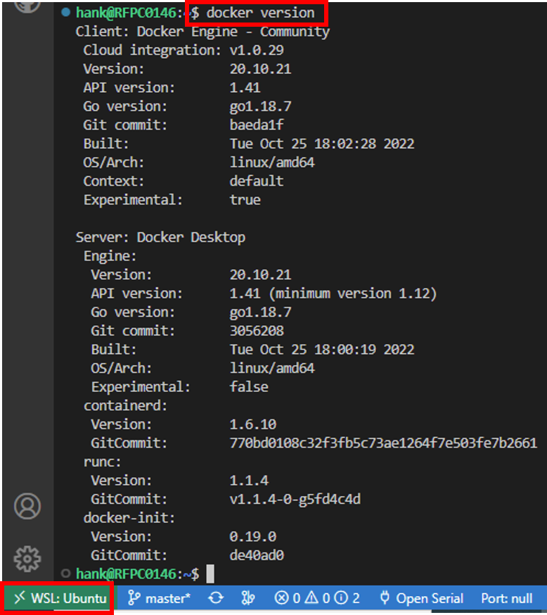
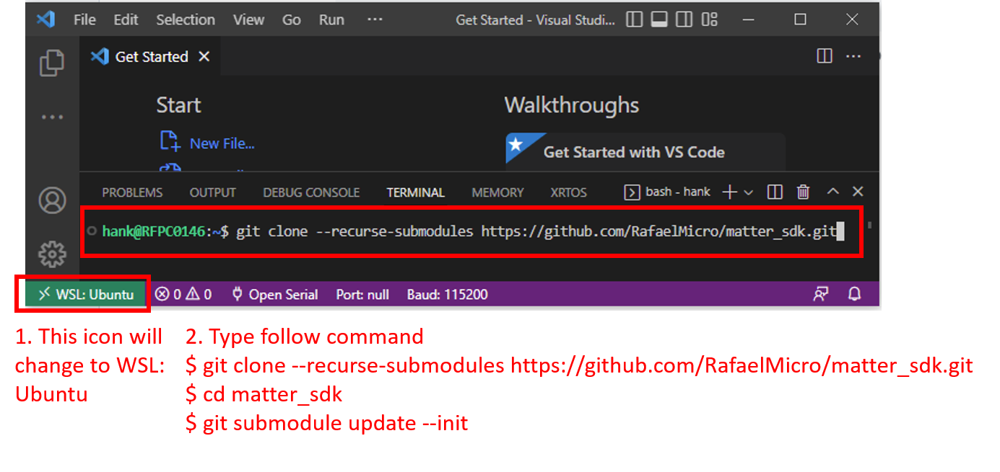
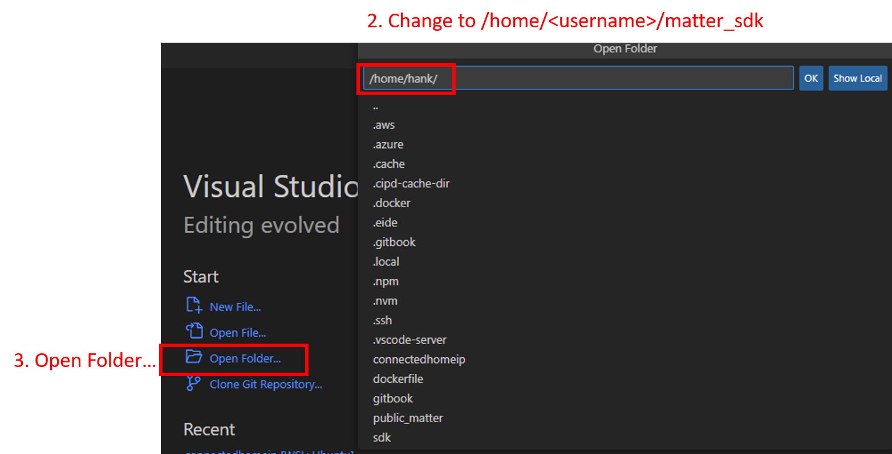
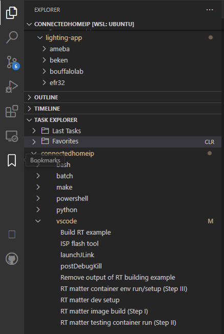

# Building Matter For Windows

## Pre-request

-   Make sure your System Disk (C:/) has 30GB of space to set up the
    environment. (include Matter source code)
-   Visual Studio Code: [Download](https://code.visualstudio.com/Download)
-   Download Ubuntu from Microsoft Store!



## Check Windows pre-request

> **Note**: '$' means this command run on a Linux terminal, others run on
> PowerShell

### Check WSL installed:

-   Check WSL in your windows, open PowerShell run:
    ```
    wsl
    ```
    **If you get the command not found message, you need to activate WSL in
    Windows. Please follow
    [Microsoft install WSL document](https://learn.microsoft.com/zh-tw/windows/wsl/install-manual)
    (NOTE: Please ignore the Windows version check, sometimes the newer version
    also didn't supports "Windows Virtual Machine feature")**

### Setting Windows environment:

-   Make sure the WSL's version is version 2, so we update WSL: (This command
    run with administrator PowerShell)
    ```
    wsl --install
    ```
-   Set default WSL to WSL2 (This command run with administrator PowerShell)
    ```
    wsl --set-default-version 2
    ```
-   Launch Ubuntu on WSL (This command run with administrator PowerShell)
    `wsl --install -d Ubuntu` **Here you need to reopen your PowerShell**
-   Check WSL version:
    ```
    wsl --list --verbose
    NAME      STATE           VERSION
    * Ubuntu    Running         1
    ```
-   **If your "VERSION" is still in version 1**, set it to version 2: Setting
    Ubuntu's WSL version to WSL2
    ```
    wsl --set-version Ubuntu 2
    ```
-   Check WSL version again:
    ```
    wsl --list --verbose
    NAME      STATE           VERSION
    * Ubuntu    Stopped         2
    ```

---

## Setup your WSL network to access the debugger

-   Make sure your vEthernet (WSL) is in the IP list:

    ```
    ipconfig

    Windows IP 設定
    乙太網路卡 乙太網路 2:
    連線特定 DNS 尾碼 . . . . . .: smb.com
    連結-本機 IPv6 位址 . . . . .: fe80::c87:726a:2015:4915%15
    IPv4 位址  . . . . . . . . .: 192.168.1.29
    子網路遮罩  . . . . . . . . .: 255.255.255.0
    預設閘道  . . . . . . . . . .: 192.168.1.254
    乙太網路卡 vEthernet (WSL):
    連線特定 DNS 尾碼 . . . . . .:
    連結-本機 IPv6 位址 . . . . .: fe80::cc59:52d8:9dda:62f2%35
    IPv4 位址 . . . . . . . . . : 172.18.224.1
    子網路遮罩 . . . . . . . . . : 255.255.240.0
    ```

-   Using admin PowerShell execute: (This command run with administrator
    PowerShell)
    ```
    New-NetFirewallRule -DisplayName "WSL" -Direction Inbound -InterfaceAlias "vEthernet (WSL)"
    ```

### Activate WSL2

-   open VScode and install some extensions for developing the environment
    -   WSL (ms-vscode-remote.remote-wsl)



-   Using the lower left icon (like this ><) and select the new WSL window
    -   Now the vscode terminal will be a Linux terminal (like this
        sw@DESKTOP-JNHERQ8:~$)



---

## Install Docker

### Windows Docker Desktop

-   Docker Desktop:
    [Download](https://desktop.docker.com/win/main/amd64/Docker%20Desktop%20Installer.exe?utm_source=docker&utm_medium=webreferral&utm_campaign=dd-smartbutton&utm_location=module)
-   You can follow the default installation: (Use WSL2 ... is an important
    setting)



-   If you get this message, it means the installer account and the launcher
    account are different. Please set your windows user group, following the
    [URL](https://icij.gitbook.io/datashare/faq-errors/you-are-not-allowed-to-use-docker-you-must-be-in-the-docker-users-group-.-what-should-i-do)
    ```
    'You are not allowed to use Docker, you must be in the "docker-users" group'.
    ```
-   If you get a Docker permission error, run this command in WSL:
    ```
    $ sudo usermod -aG docker $USER
    ```

---

## Building Matter For Windows

### Checking Docker work on WSL



-   In the WSL terminal use the following command to check the docker state.

    ```
    $ docker version
      Client: Docker Engine - Community
       Cloud integration: v1.0.29
       Version:           20.10.21
       API version:       1.41
       Go version:        go1.18.7
       Git commit:        baeda1f
       Built:             Tue Oct 25 18:02:28 2022
       OS/Arch:           linux/amd64
       Context:           default
       Experimental:      true

      Server: Docker Desktop
       Engine:
        Version:          20.10.21
        API version:      1.41 (minimum version 1.12)
        Go version:       go1.18.7
        Git commit:       3056208
        Built:            Tue Oct 25 18:00:19 2022
        OS/Arch:          linux/amd64
        Experimental:     false
       containerd:
        Version:          1.6.10
        GitCommit:        770bd0108c32f3fb5c73ae1264f7e503fe7b2661
       runc:
        Version:          1.1.4
        GitCommit:        v1.1.4-0-g5fd4c4d
       docker-init:
        Version:          0.19.0
        GitCommit:        de40ad0
    ```

-   If you get "docker: command not found", use the following commands to
    install it:
    ```
    $ sudo apt-get update
    $ sudo apt-get install docker-ce docker-ce-cli containerd.io docker-compose-plugin
    $ sudo usermod -aG docker $USER
    $ sudo docker run hello-world
    ```

---

## Building Matter

-   In the WSL terminal use the following command to clone the project, and run
    the following command to sync the submodule:
    ```
    $ git clone --recurse-submodules https://github.com/RafaelMicro/matter_sdk.git
    $ cd matter_sdk
    $ git submodule update --init
    ```



-   To get started select "Open folder..." to open "matter_sdk" folder



### Setup environment (in Remote WSL)

-   Install VSCode extension
    -   Install all recommendations tools:
    -   spmeesseman.vscode-taskexplorer
    -   ms-vscode.cpptools
    -   ms-vscode-remote.remote-containers
    -   ms-azuretools.vscode-docker
    -   dan-c-underwood.arm
    -   twxs.cmake
    -   vadimcn.vscode-lldb
    -   marus25.cortex-debug

### Setup Rafael Matter Docker



-   Run VSCode task: "RT matter dev setup" Task "RT matter dev setup" includes
    three sub-task:
    -   "RT matter image build (Step I)"
    -   "RT matter container env run/setup (Step II)"

### Building project

```
NOTE: When the first time building, Matter will setup the matter environment (GCC toolchain, Python, GN)
```

-   Run VSCode task: "Build RT example":
    1.  Select target board (RT582/RT583)
    2.  Select OTA support or not
    3.  Select sleep end device (SED) support or not
    4.  Select certs support or not

## Debugger setup

### Pre-request

SEGGER JLink: [Download](https://www.segger.com/downloads/jlink/)

### Setup Network connection between windows and WSL2

Windows should accept WSL to access the host network, so we need to set up the
FireWall setting with "PowerShell administrator"

```
New-NetFirewallRule -DisplayName "WSL" -Direction Inbound -InterfaceAlias "vEthernet (WSL)" -Action Allow
```

WSL we need setup a host IP's environment variable for VScode to debug scripts

-   ~/.bashrc add the following setting:

```
$ sudo <your_text_editor> ~/.bashrc
export WSL_HOST_IP=$(cat /etc/resolv.conf | sed -rn 's|nameserver (.*)|\1|p')
$ source ~/.bashrc
```

-   Install some packages for the debugger

```
$ sudo apt-get update
$ sudo apt-get install libncurses5
```

**Close all Vscode window, and reopen it (This action will help VScode apply the
WSL's environment values)**

### Setup Configure

-   Add Rafael's configure file to JLink:
    -   Append JLinkDevices.xml and RT58x_1MB.FLM to JLink path (ex:C:\Program
        Files (x86)\SEGGER\JLink)
-   Config VSCode debugger setup (task.json): - From Task launchJLink "label":
    "launchJLink" - JLink setup : replace command <JLinkGDBServerCL.exe path>,
    ex: /mnt/c/Program Files (x86)/SEGGER/JLink/JLinkGDBServerCL.exe ( in WSL
    C:/ should change to /mnt/c/) **Note: This debugger's Arm Toolchain and
    execute file will use matter code and decker env, so you need setup matter
    env before the debugger**
