# RT58x Matter SDK Application Note

## Matter Device Guide

After successfully building and flashing a Matter application image to the target (EVK) board, follow the steps in the sections below to commission and control the device using a third-party Matter controller, such as the Apple HomePod mini or Google Nest Hub.

> **Important:** The attestation certificates (PAI/DAC) and Certification Declaration (CD) included in the Rafael Matter SDK are for **testing purposes only** and are not intended for production use. Contact Rafael Micro for information on obtaining official certificates.

---

### Pairing with Apple HomePod mini

The following steps demonstrate how to commission a Matter over Thread light bulb device to an Apple HomePod mini and control it through the Apple Home app. A light bulb built from `./examples/lighting-app` is used as the example.

**Prerequisites:** Ensure your Apple HomePod mini is set up correctly and visible in the Apple Home app before proceeding.

**Step 1 — Flash the firmware**
Flash the light bulb image (built from `./examples/lighting-app`) to the EVK board using the ISP tool.

**Step 2 — Reset to factory defaults**
After flashing, press and hold the **Reset to Default** button for at least **6 seconds** to clear any previously stored Matter commissioning data and return the device to factory-new state.

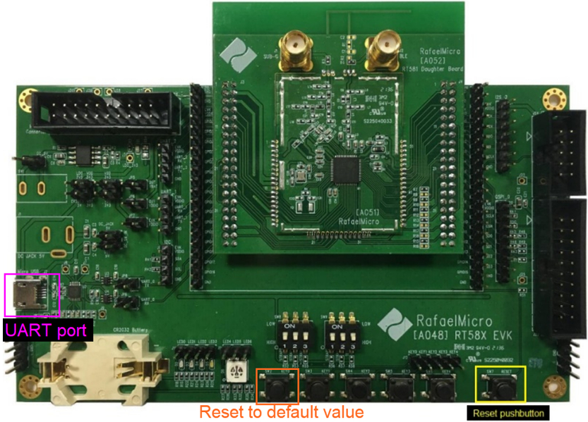

The UART terminal will display the following reset messages to confirm the operation:

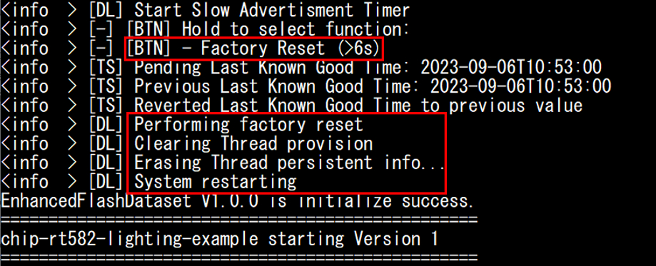

**Step 3 — Start adding the accessory in Apple Home**
Once the device resets, it automatically enters commissioning mode. Open the **Apple Home** app, tap the **"+"** button, and select **Add Accessory**.

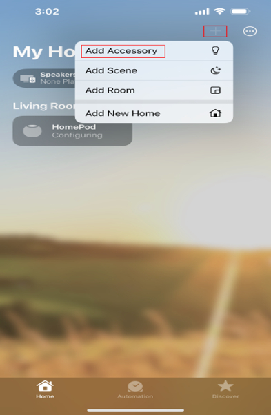

**Step 4 — Scan the QR code or enter the setup code**
The Home app will prompt you to scan the Matter QR code. The QR code link is printed in the UART terminal output:

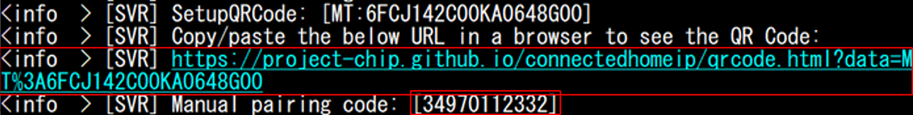

Copy and paste the `https` link into a browser to display the QR code, then scan it with the Home app.

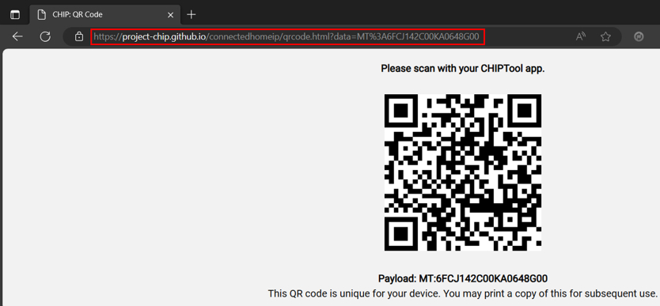

Alternatively, tap **More Options** and enter the manual setup code: **34970112332**

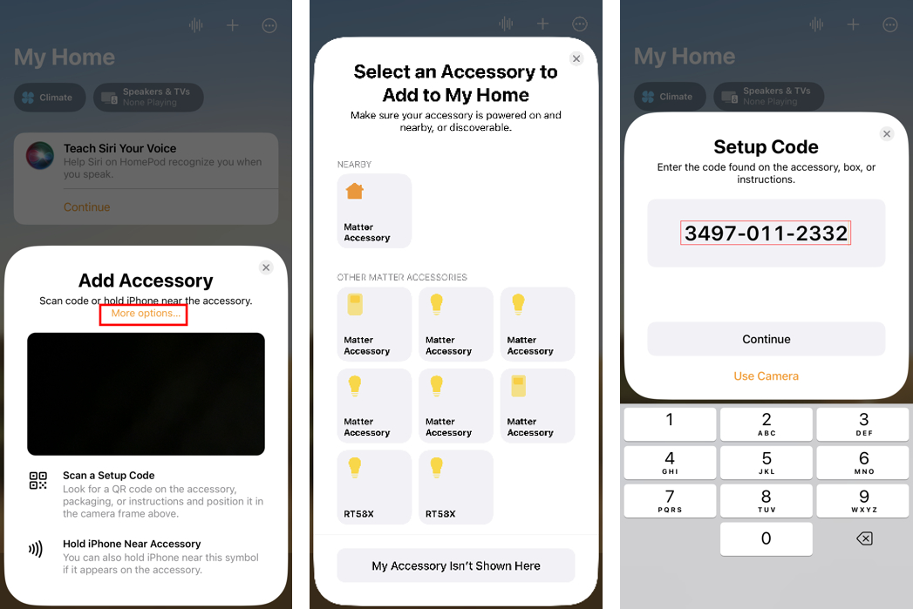

**Step 5 — Configure location and device name**
Follow the on-screen prompts to assign the accessory to a room and set its name.

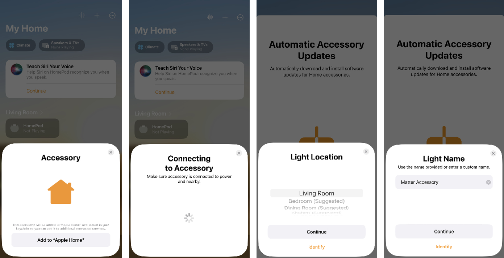

> **Note:** Because this device uses test certificates (PAI/DAC/CD), the Home app will display an **"Uncertified Accessory"** warning. Tap **Add Anyway** to complete the commissioning process.

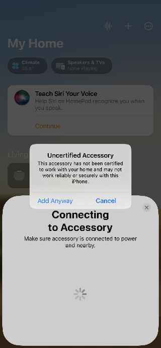

**Step 6 — Commissioning complete**
The light bulb device is now added to your Apple Home. Press the button on the EVK board to toggle the light; the onboard LED will reflect the current on/off state.

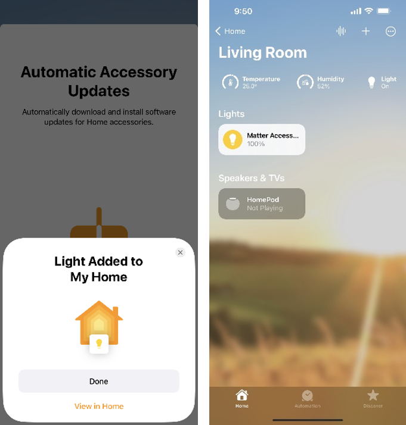

---

### Pairing with Google Nest Hub

The following steps demonstrate how to commission a Matter over Thread light bulb device to a Google Nest Hub and control it through the Google Home app. A light bulb built from `./examples/lighting-app` is used as the example.

**Prerequisites:**
- Ensure your Google Nest Hub is set up correctly and visible in the Google Home app before proceeding.
- A **Google for Developers** account is required to use test certificates (PAI/DAC/CD) with the Google Home app. Refer to the [Google Home Developer site](https://developers.home.google.com/) for account setup details.

**Step 1 — Flash the firmware**
Flash the light bulb image (built from `./examples/lighting-app`) to the EVK board using the ISP tool.

**Step 2 — Reset to factory defaults**
After flashing, press and hold the **Reset to Default** button for at least **6 seconds** to clear any previously stored Matter commissioning data and return the device to factory-new state.

The UART terminal will display the following reset messages to confirm the operation:

**Step 3 — Open the Google Home app and add a device**
Once the device resets, it automatically enters commissioning mode. Open the **Google Home** app and tap the **Devices** button.

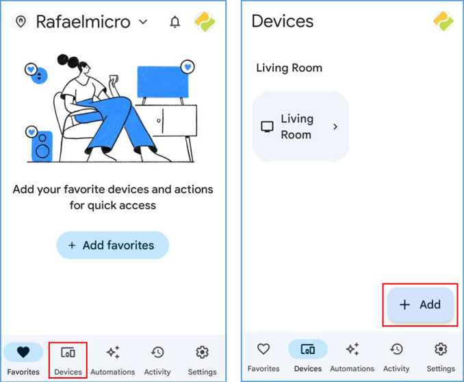

**Step 4 — Select "New device"**
Tap **New device** to begin the commissioning process.

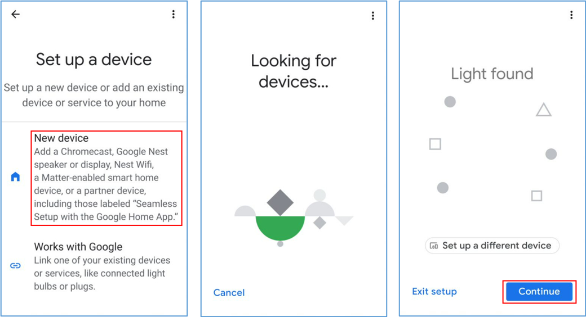

**Step 5 — Scan the QR code**
The Google Home app will prompt you to scan the Matter QR code. The QR code link is printed in the UART terminal output:

Copy and paste the `https` link into a browser to display the QR code, then scan it with the Google Home app.

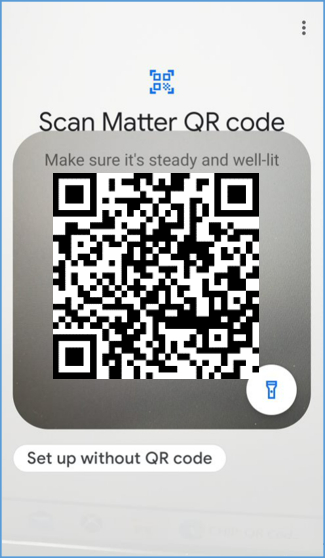

**Step 6 — Agree to connect**
Tap **Agree** to authorize the connection to the device.

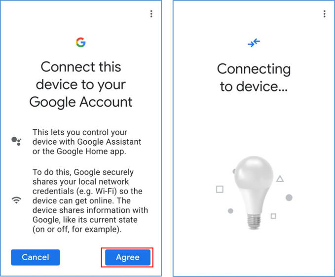

**Step 7 — Wait for the device to connect**
The app will show a progress indicator while commissioning completes.

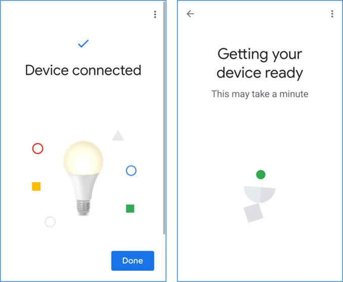

**Step 8 — Commissioning complete**
The Google Home app will display the device once the connection is successful. Press the button on the EVK board to toggle the light; the onboard LED will reflect the current on/off state.

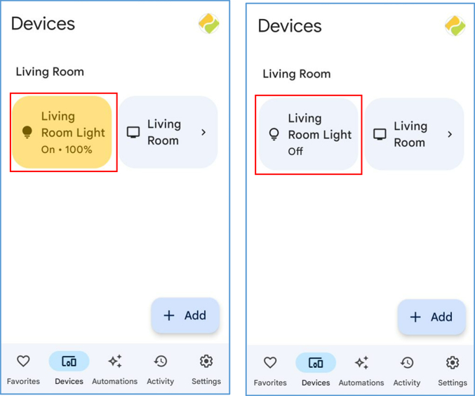
