# RT58x Matter SDK Application Note

## Introduction

This document primarily provides a basic reference process for users of the Rafael RT58x SDK to develop Matter devices. Users can refer to the steps described in the following sections to become familiar with the Matter development process.
- Building Matter over Thread Images for Linux/MacOS
- Flashing Matter Images
- Matter Device Interoperability Testing

---

## Building Matter over Thread Images for Linux/MacOS
### Setting Up the Matter SDK Environment

Before building, you'll need to install a few OS-specific dependencies.
- For Linux:
On Debian-based Linux distributions such as Ubuntu, these dependencies can be satisfied with the following:
```
$ sudo apt-get install git gcc g++ pkg-config libssl-dev libdbus-1-dev \
     libglib2.0-dev libavahi-client-dev ninja-build python3-venv python3-dev \
     python3-pip unzip libgirepository1.0-dev libcairo2-dev libreadline-dev
```
- For macOS:
On macOS, first install Xcode from the Mac App Store. The remaining dependencies can be installed and satisfied using Brew:
```
$ brew install openssl pkg-config
```
However, that does not expose the package to pkg-config. To fix that, one needs to run something like the following:
Intel:
```
$ cd /usr/local/lib/pkgconfig
$ ln -s ../../Cellar/openssl@1.1/1.1.1g/lib/pkgconfig/* .
```
where openssl@1.1/1.1.1g may need to be replaced with the actual version of OpenSSL installed by Brew.
Apple Silicon:
```
$ export PKG_CONFIG_PATH=$PKG_CONFIG_PATH:"/opt/homebrew/opt/openssl@3/lib/pkgconfig"
```
Note: If using MacPorts, port install openssl is sufficient to satisfy this dependency.

---
### Prepare for Building
Please open the terminal with the following command to clone the project and sync the related submodules:
```
$ git clone --recurse-submodules https://github.com/RafaelMicro/matter_sdk.git
$ cd matter_sdk
$ git submodule update --init
```
Before running any other build command, the scripts/activate.sh environment setup script should be sourced at the top level. This script takes care of downloading GN, ninja, and setting up a Python environment with libraries used to build and test.
```
$ source scripts/activate.sh
```
If this script says the environment is out of date, it can be updated by running:
```
$ source scripts/bootstrap.sh
```
The **scripts/bootstrap.sh** script re-creates the environment from scratch, it might take time, so avoid running it unless the environment is out of date. 

### Building
Run the following command to build a project:
```
$ ./scripts/examples/gn_rt58x_example.sh ./examples/<project-name>/rt58x ./out/<project-name> <Board(RT583)> <optional>
```
Example:
```
$ ./scripts/examples/gn_rt58x_example.sh ./examples/lighting-app/rt58x ./out/lighting-app RT583
$ ./scripts/examples/gn_rt58x_example.sh ./examples/lighting-app/rt58x ./out/lighting-app RT583 --sed=yes --ota=yes
$ ./scripts/examples/gn_rt58x_example.sh ./examples/lighting-app/rt58x ./out/lighting-app RT583 --sed=yes --ota=yes --certs=yes
Where the parameters:
->	RT583: select the target board
->	--sed=yes: build for sleepy end device, enable the power saving
->	--ota=yes: build to support the OTA function
->	--certs=yes: build to support the custom certificate
```
The generated image file will be located in the folder ./out/<project-name> <Board(RT583)>, if you're planning to build the example for a different kit or make changes to the configuration, remove all build artifacts before building. To do so, use the following command:
```
$ sudo rm -fr ./out/<project-name>
```
## Flashing Matter Images
RT58x Matter SDK provided an In System Program (ISP) tool for users to download the boot loader or application images to the Rafael Micro. EVK board. It can update the Matter related certificates with a Rafael Micro. specified file format as well. The ISP tool uses the UART interface to communicate with EVK. The environment setup is shown in the figure below:  
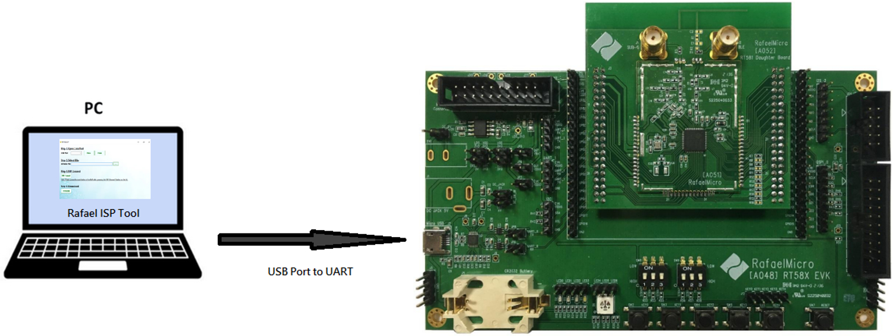

### ISP Tool
Please unzip the IoT_EVLUATION_TOOL_RT58x_vxxx.zip and double click on the IoT_EVALUATION_TOOL.exe and selecting to run the ISP tool:  
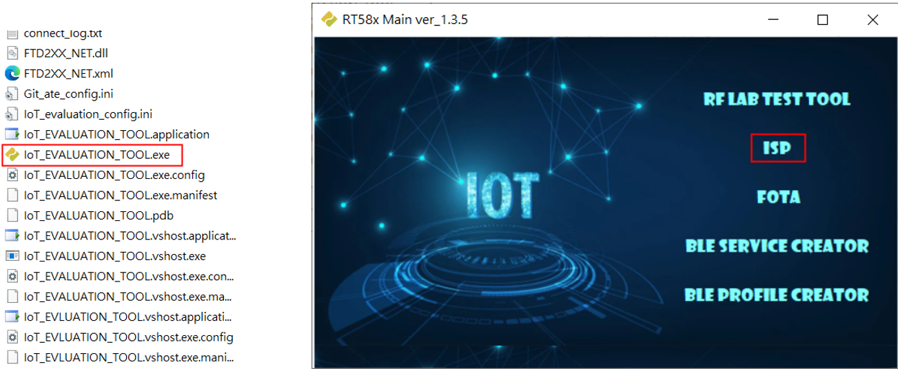  
  
Below shows how to use the ISP tool connects with the target board and flash the related binary images.  
(i). Open the COM Port 
In order to increase the transmission rate of ISP operations, we need to lower the latency time. To do this, set the Latency Timer of COM port by following steps:
1.	In Windows Device Manager, right-click your COM port from the list. 
2.	In the drop-down menu that opens, select “Properties”. 
3.	Click the Port Settings tab. 
4.	Click the Advanced… button. 
5.	In the Advanced Settings window, find the Latency Timer field, and set the value to 1 msec for best performance.  
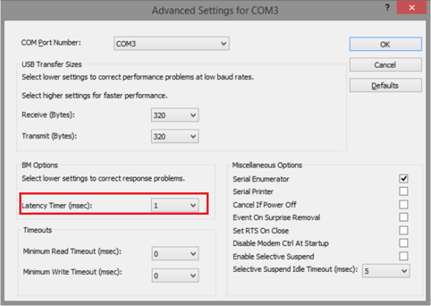  
After completing the above steps, please back to the ISP tool select the correct COM Port and press the "Open" button.  


(ii). Select the image Files
There are three types of binary files:
Bootloader image
Please find the bootloader.bin file in the released Matter SDK.
Application image
Please select the location of the Matter application image file built from the SDK.
Here we use “chip-rt58x-lighting-app-example.bin” as an example.
User must specify the flash memory start address of application bin file. Default is 0x8000.  
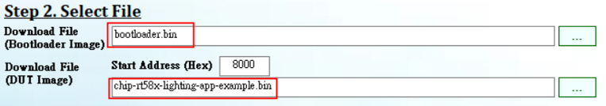  

(iii). ISP Connect
There are mainly three parts (1, 3, 6) that the user needs to execute.
1.	[User operation] Press the "ISP Connect" button on the UI.  
  
2.	[ISP tool response] Pops up prompt to press EVK reset.
3.	[User operation] Press EVK reset.
4.	[ISP tool response] Pops up prompt to press EVK reset.
5.	[User operation] Press EVK reset.
6.	[ISP tool response] Device has entered ISP mode.  
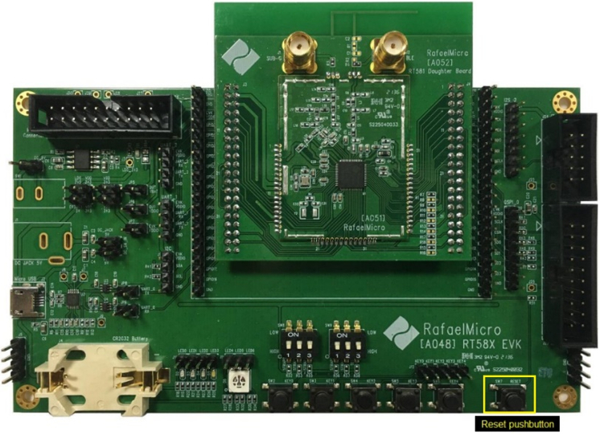  
Then ISP tool GUI will show the UART connection successful message.  
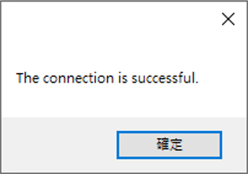  

(iv). Download
Press the "Download" button to download bin files (Bootloader or DUT(Application)) Image. When download completed, it will show "Download OK".  

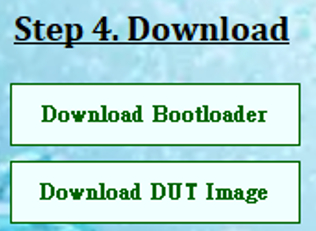  

### Flash Erase (optional)
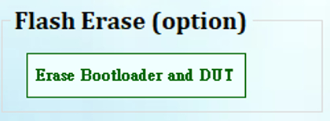  

Press the "Erase" button to erase the Flash. It will show "Erase OK" when erasing is complete. When using the ISP tool Download function (Step 4. Download), it already contains the flash erasing operation. This function is used when erasing is required without the need to download Flash.

### ISP tool FAQ
If the ISP tool fails to work, users can try the following actions to solve the problem:  
(a)	Install “vcredist_x86.exe” [2012], which can be downloaded from Microsoft.
[Microsoft Visual C++ 2012 Redistributable (x86) - 11.0.61030]  
https://www.microsoft.com/zh-tw/download/details.aspx?id=30679  
https://www.microsoft.com/en-US/Download/confirmation.aspx?id=30679  
(b)	Please run this application as "Administrator".
## Matter Device Interoperability Testing
After succussing build the Matter application image and download it to the target(/EVK) board, the user can follow the steps descripted in the following sections to commissioning and control with the third party Matter controller, i.e.: Apple HomePod mini, Google Nest Hub.  
**-->** Please be noted that both the attestation certificate (PAI/DAC) and certification declaration (CD) for a Matter device used in the Rafael Matter SDK are only for testing purpose, these certifications are not for the official production released, if the official certificates are need, please contact Rafael Micro. for the detail.

### Interoperability Testing with Apple HomePod mini
Using a light bulb as an example, to demonstrates the process of integrating a Matter over Thread) light bulb device with a Apple HomePod mini and controlling it through the Apple Home app. Please be sure that your Apple HomePod mini can work correctly and recognized by your Apple Home App before starting the following steps.

-	Step 01: update the light bulb image build from the project ./examples/lighting-app with the ISP tool.
-	Step 02: after download image successful, please press and hold the “Reset to default value” button at least for 6 seconds to clear the previously Matter information and start the factory new commissioning process.  
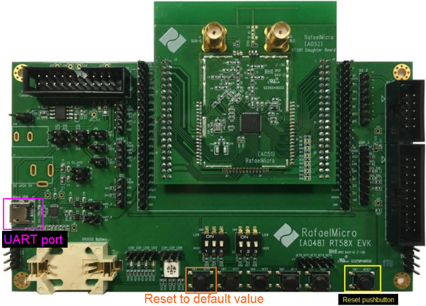  
It will show the following reset to default related messages in the UART terminal:  
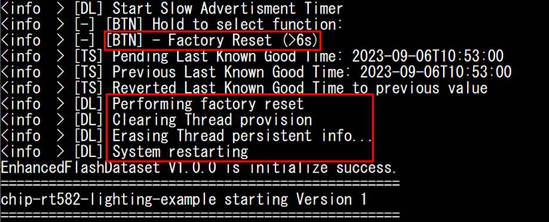  
-	Step 03: after the device reset to default value, it will start the commissioning process automatically, please start the Apple Home App and press the “+” button to start adding the accessory (light bulb) device.  
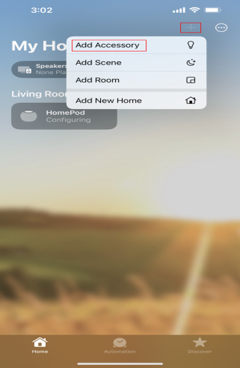  
-	Step 04: the Home App will request to scan the Matter device QR code or setup code, it can be found in the device’s UART messages:  
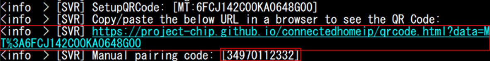  
Please copy & paste the https link to a web browser, the QR code will show on the screen, please scan the QR code with Home App.  
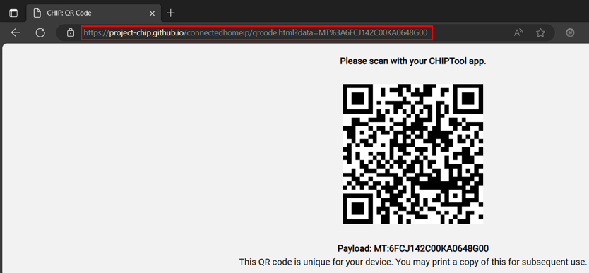  
Or select “More options”, using the setup code 34970112332 instead  
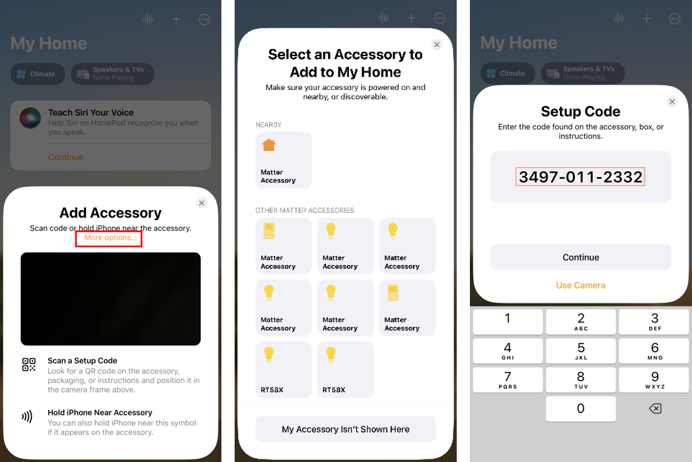  
-	Step 05: add to the Apple Home App and setup the location and device name.  
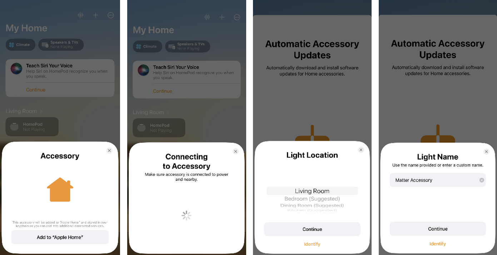  
**->** Please be noted that the Matter light device currently is using the test certificates (PAI/DAC/CD), the Home App will show “Uncertified Accessory” message to notify the user, please select “Add Anyway” to complete the add accessory process.  
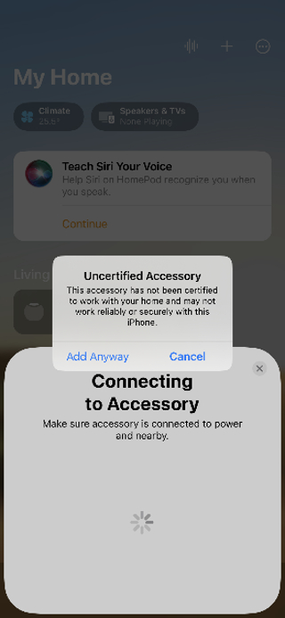  
-	Step 06: done. The user can simply press the button to toggle the light device, the LED on the target(/EVK) board will indicate the on/off state as well.  
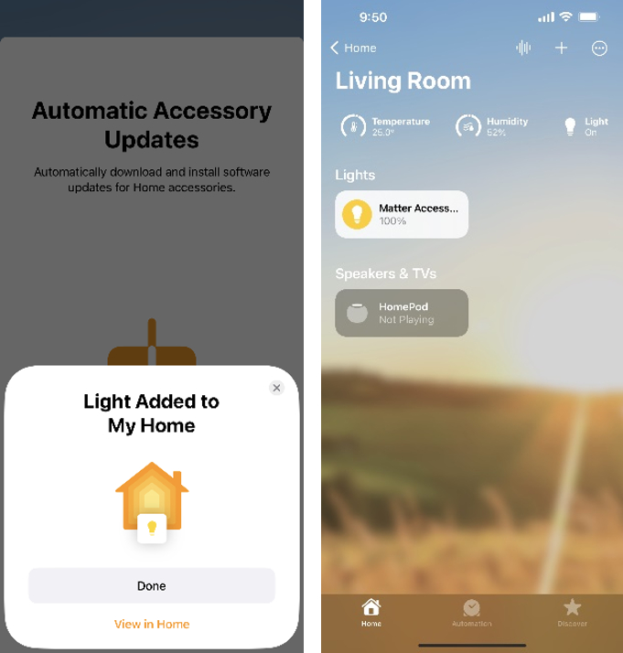  

### Interoperability Testing with Google Nest Hub
Using a light bulb as an example, to demonstrates the process of integrating a Matter over Thread light bulb device with a Google Nest Hub and controlling it through the Google Home app. Please be sure that your Google Next Hub can work correctly and recognized by your Google Home App before starting the following steps.  
**Note**: It needs to apply the “Google for Developers” account and sign in the Google Home App for the following interoperability test(using test certificates: PAI/DAC/CD), please refer to the following link for the detail: https://developers.home.google.com/  
-	Step 01: update the light bulb image build from the project ./examples/lighting-app with the ISP tool.
-	Step 02: after download image successful, please press and hold the “Reset to default value” button at least for 6 seconds to clear the previously Matter information and start the factory new commissioning process.  
  
It will show the following reset to default related messages in the UART terminal:  
  
-	Step 03: after the device reset to default value, it will start the commissioning process automatically, please start the Google Home App and press the Devices button to start adding the new light bulb device.   
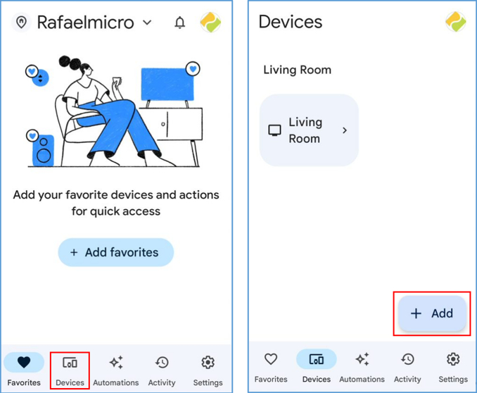  
-	Step 04: select the “New device” to start the commissioning process.  
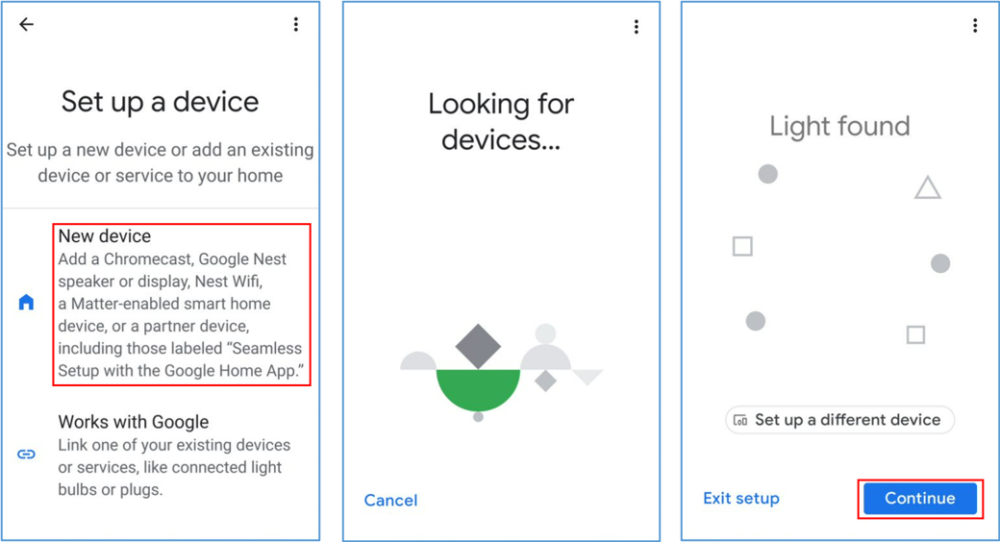  
-	Step 05: the Home App will request to scan the Matter device QR code, it can be found in the device’s UART messages:  
  
Please copy & paste the https link to a web browser, the QR code will show on the screen, please scan the QR code with Google Home App.  
  
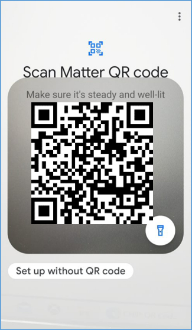  
-	Step 06: press Agree to connect to the device.  
  
-	Step 07: waiting the device ready.  
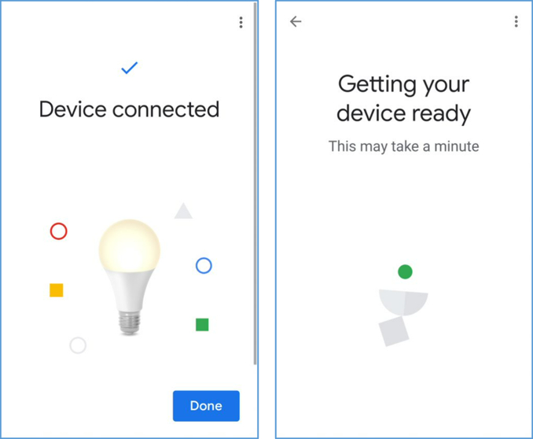  
-	Step 08: the Google Home App will show the device when connection successful. The user can simply press the button to toggle the light device, the LED on the target(/EVK) board will indicate the on/off state as well.  
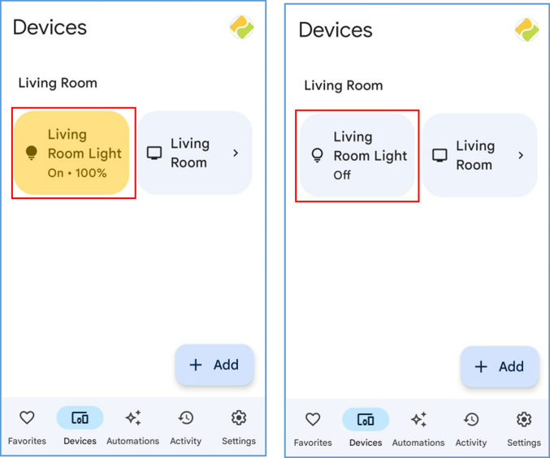