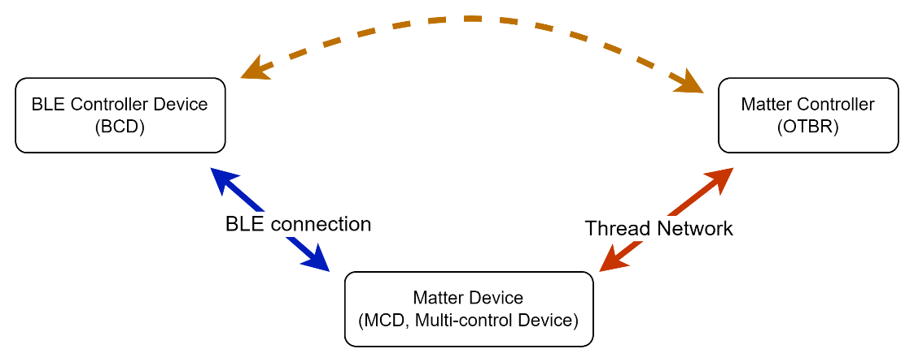
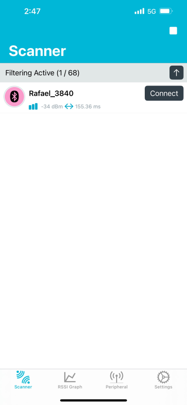
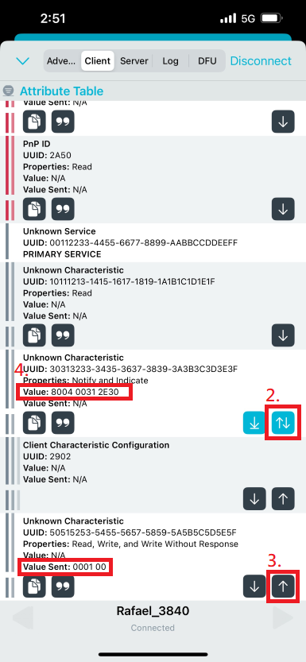
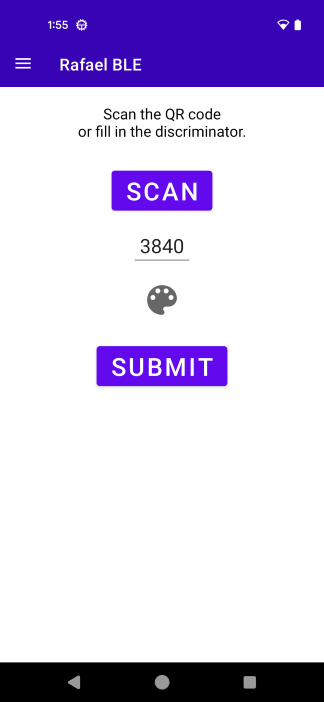
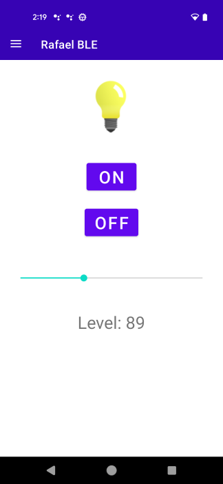

# Matte BLE Multi Control Guide

## Introduction

This document aims to describe the environment based on Rafael Micro's Matter SDK (Matter over Thread), while also offering BLE connectivity. This allows users to control/set the behavior of the device itself through BLE connection. To compensate for the limited functionality of current Matter devices, developers can also use BLE connectivity to provide specific device settings via BLE.

In this document, we will use the term Multi-control Device (MCD) to represent devices that support both Matter over Thread and BLE communication technologies, and BLE Controller Device (BCD) to represent devices that use BLE as the communication technology to control MCD. The following sections introduce the operation methods and command formats of Rafael Multi Control, including:

1. Device management
2. Matter cluster/attribute access commands



## Building Lighting app with BLE multi control feature

In [args.gni](../examples/lighting-app/rt58x/args.gni), there's an argument called raf_enable_multi_control, set the argument to true to enable multi control feature.
Note that if user want to enable this feature other than lighting app, a handler is needed to process ble message. Please refer to [AppTask.cpp](../examples/lighting-app/rt58x/src/AppTask.cpp) and [RafaelMultiControl.cpp](../src/platform/RT58x/RafaelMultiControl.cpp).

```cpp
void AppTask::ChipEventHandler(const ChipDeviceEvent * aEvent, intptr_t /* arg */)
{
    ChipLogProgress(NotSpecified, "ChipEventHandler: %x", aEvent->Type);
    // sys_malloc_info_printf();
  
    switch (aEvent->Type)
    {
#if RAF_ENABLE_MULTI_CONTROL
    case DeviceEventType::kBleToApp:
        RafMCMgr().HandleBleMessage(aEvent);
        break;
#endif
    default:
        break;
    }
}
```

## Establish BLE connection

The following example demonstrates connecting using the Android app 'nRF Connect for Mobile'.

1. Scan for BLE device named with preffix "Rafael_" followed by discriminator. Click connect button.



2. Indicating characteristic 30313233-3435-3637-3839-3A3B-3C3D-3E3F
3. Write to characteristic 50515253-5455-5657-5859-5A5B-5C5D-5E5F
4. Characteristic 30313233-3435-3637-3839-3A3B-3C3D-3E3F will receive the replied message



## Rafael BLE command structure

After establishing BLE connection between MCD & BCD, data exchange must complete with the following command structure:


| BLE message type  | Length  | Payload  |
| :---------------- | :------ | :------- |
| 1 byte            | 1 byte  | n bytes  |

* BLE message type field: The highest bit(bit7) represents the direction of the message command transmission.
  * Bit_7 = 0: Message sent to MCD via BLE
  * Bit_7 = 1: Message sent to BCD via BLE

Length field: The length of payload in bytes

## Device management command

- [Read firmware information](#1)
- [Read the number of device](#2)
- [Read endpoint and device type](#3)
- [Read number of supported cluster](#4)
- [Read cluster ids of the device](#5)
- [Read device mode](#6)
- [Custom command](#7)

<span id = 1>**Read firmware information**</span>

  * BLE message type:0x00
  * BCD can use the following command message to read the firmware version information from MCD


    | BLE message type  | Length  | Payload  |
    | :---------------- | :------ | :------- |
    | 1 byte            | 1 byte  | 1 bytes  |
    | 0x00              | 0x01    | 0x00     |

**Read firmware information response**

  * BLE message type:0x80
  * The MCD responds with firmware version information to the BCD using 0x80, with the payload format: status (1 byte) + firmware version string (n bytes)


    | BLE message type  | Length  | Status   | Firmware version |
    | :---------------- | :------ | :------- | :--------------- |
    | 1 byte            | 1 byte  | 1 bytes  | n bytes          |
    | 0x80              | 0x01    |  x       | x                |

  * Status field represents the result of executing the command:
      * 0x00: Success
      * 0x01: Failed

  * Firmware version field represent firmware version string of the device

  * example:
      The following command means that the firmware version string is "1.0.0"

      | BLE message type   | Length   | Status    | Firmware version          |
      | :----------------  | :------  | :-------  | :-------                  |
      |      1 byte        | 1 byte   | 1 bytes   | n bytes                   |
      |       0x80         |  0x06    |  0x00     | 0x31 0x2E 0x30 0x2E 0x30  |


<span id = 2>**Read the number of device**</span>

  * BLE message type:0x01
  * Matter devices allow multiple Matter device functionalities to run simultaneously on a single physical device. We can use this command to obtain the number of devices implemented on the MCD.

    | BLE message type  | Length  | Payload  |
    | :---------------- | :------ | :------- |
    | 1 byte            | 1 byte  | 1 bytes  |
    | 0x01              | 0x01    | 0x00     |

**Read the number of device response**

  * BLE message type:0x01
  * Payload field means the device nember of MCD

    | BLE message type  | Length  | Payload  |
    | :---------------- | :------ | :------- |
    | 1 byte            | 1 byte  | 1 bytes  |
    | 0x81              | 0x01    |  x       |
 
  * example:
    The following command means that the MCD has implemented 3 device

    | BLE message type  | Length   | Payload   |
    | :---------------- | :------- | :-------- |
    | 1 byte            | 1 byte   | 1 bytes   |
    | 0x81              | 0x01     | 0x3       |

<span id = 3>**Read endpoint and device type**</span>

  * BLE message type:0x02
  * When the BCD knows the number of devices implemented by the MCD, it can use this command to find out on corresponding endpoint and device type of the index.

    | BLE message type  | Length  | Device Index  |
    | :---------------- | :------ | :------------ |
    | 1 byte            | 1 byte  | 1 bytes       |
    | 0x02              | 0x01    | x             |

  * For example, from **Read the number of device response**, we know that the MCD has 3 device implemented on it, the device index field could be 0x00/0x01/0x02.

**Read endpoint and device type response**

  * BLE message type:0x82

    | BLE message type  | Length  | Status       |Device index       |Device type       |Endpoint        |
    | :---------------- | :------ | :----------- |:----------------- |:---------------- |:-------------- |
    | 1 byte            | 1 byte  | 1 bytes      | 1 bytes           | 4 bytes          | 2 byte         |
    | 0x82              | 0x01    |  x           | x                 | x                | x              |
 
  * example:
    The following command means that the device type of device index 0x00 is 0x10D(color dimmable light) and the endpoint is 0x0001.

    | BLE message type  | Length  | Status       |Device index       |Device type           |Endpoint        |
    | :---------------- | :------ | :----------- |:----------------- |:-------------------- |:-------------- |
    | 1 byte            | 1 byte  | 1 bytes      | 1 bytes           | 4 bytes              | 2 byte         |
    | 0x82              | 0x01    |  0x00        | 0x00              | 0x0D 0x01 0x00 0x00  | 0x01 0x00      |

<span id = 4>**Read number of supported cluster**</span>

  * BLE message type:0x03
  * When the BCD knows the number of devices implemented by the MCD, it can use this command to find out how many clusters are implemented by the MCD.

    | BLE message type  | Length  | Device Index  |
    | :---------------- | :------ | :-------      |
    | 1 byte            | 1 byte  | 1 bytes       |
    | 0x03              | 0x01    | x             |

  * For example, from **Read the number of device response**, we know that the MCD has 3 device implemented on it, the device index field could be 0x00/0x01/0x02.

**Read number of supported cluster response**

  * BLE message type:0x83

    | BLE message type  | Length  | Status       |Device index       |Cluster number    |
    | :---------------- | :------ | :----------- |:----------------- |:---------------- |
    | 1 byte            | 1 byte  | 1 bytes      | 1 bytes           | 1 bytes          |
    | 0x83              | 0x01    |  x           | x                 | x                |
 
  * example:

    The following command means that the supported cluster number of device index 0x00 is 3.

    | BLE message type  | Length  | Status       |Device index       |Cluster number    |
    | :---------------- | :------ | :----------- |:----------------- |:---------------- |
    | 1 byte            | 1 byte  | 1 bytes      | 1 bytes           | 1 bytes          |
    | 0x83              | 0x01    | 0x00         | 0x00              | 0x03             |

 
<span id = 5>**Read cluster ids of the device**</span>

  * BLE message type:0x04
  * When the BCD knows the number of clusters implemented on the device, it can use this command to find out the cluster id of the corresponding cluster index. 

    | BLE message type  | Length  | Device Index  | Cluster Index|
    | :---------------- | :------ | :-------      |:-------      |
    | 1 byte            | 1 byte  | 1 bytes       |1 bytes       |
    | 0x04              | 0x01    | x             |x             |

  * For example, from **Read number of supported cluster response**, we know that the MCD has 3 clusters implemented on device index 0x00, the device index field is 0x00 and cluster index field could be 0x00/0x01/0x02.

**Read cluster ids of the device response**

  * BLE message type:0x84

    | BLE message type  | Length  | Status       |Device index       |Cluster index       |Cluster Id        |
    | :---------------- | :------ | :----------- |:----------------- |:------------------ |:---------------- |
    | 1 byte            | 1 byte  | 1 bytes      | 1 bytes           | 1 bytes            | 4 bytes          |
    | 0x84              | 0x01    |  x           | x                 | x                  | x                |
 
  * example:
    The following command means that the cluster id on device index 0x00 and cluster index 0x00 is 0x0006.

    | BLE message type  | Length  | Status       |Device index       |Cluster index       |Cluster Id           |
    | :---------------- | :------ | :----------- |:----------------- |:------------------ |:------------------- |
    | 1 byte            | 1 byte  | 1 bytes      | 1 bytes           | 1 bytes            | 4 bytes             |
    | 0x84              | 0x01    | 0x00         | 0x00              | 0x00               | 0x06 0x00 0x00 0x00 |

<span id = 6>**Read device mode**</span>

  * BLE message type:0x05
  * The BCD can use this command to read the current operating mode of the MCD

    | BLE message type  | Length  | Payload  |
    | :---------------- | :------ | :------- |
    | 1 byte            | 1 byte  | 1 bytes  |
    | 0x05              | 0x01    | 0x00     |

**Read device mode response**

  * BLE message type:0x85

    | BLE message type  | Length  | Device mode   |
    | :---------------- | :------ | :------------ |
    | 1 byte            | 1 byte  | 1 bytes       |
    | 0x85              | 0x01    | x             |

  * The device mode is a bitmap that indicate the current operation mode of MCD
  * Bit 0: Whether Matter is comissioned
  * Bit 1~7: Reserved

<span id = 7>**Custom command**</span>

  * BLE message type:0x07
  * Users can use the command to send the custom message to MCD(BCD to MCD). The communication format for messages sent from BCD to MCD in the Payload field will be user-defined. In this mode, the format for exchanging messages between devices via BLE will be completely defined by the user.

    | BLE message type  | Length  | Payload  |
    | :---------------- | :------ | :------- |
    | 1 byte            | 1 byte  | n bytes  |
    | 0x07              | 0x01    | x        |

**Custom command response**

  * BLE message type:0x87

    | BLE message type  | Length  | Device mode   |
    | :---------------- | :------ | :------------ |
    | 1 byte            | 1 byte  | n bytes       |
    | 0x87              | 0x01    | x             |


## Matter cluster/attribute access command

- [Read Matter attribute](#8)
- [Write Matter attribute](#9)
- [Matter attribtue reporting](10)

<span id = 8>**Read Matter attribute**</span>

  * BLE message type:0x20
  * The BCD can use this command to read attributes of the MCD.

    | BLE message type  | Length  | Endpoint  | Cluster Id  | Attribute Id  |
    | :---------------- | :------ | :-------  | :---------- | :------------ |
    | 1 byte            | 1 byte  | 2 bytes   | 4 bytes     | 4 bytes       |
    | 0x20              | 0x0A    | x         | x           | x             |

  * example:
      The following command reads onoff attribute(cluster id: 0x0000_0006, attribute id: 0x0000_0000) on endpoint 1

      | BLE message type  | Length  | Endpoint  | Cluster Id          | Attribute Id        |
      | :---------------- | :------ | :-------  | :------------------ | :------------------ |
      | 1 byte            | 1 byte  | 2 bytes   | 4 bytes             | 4 bytes             |
      | 0x20              | 0x0A    | 0x01      | 0x06 0x00 0x00 0x00 | 0x00 0x00 0x00 0x00 |

**Read Matter attribute response**

  * BLE message type:0xA0
  * The MCD responds with its attribute value to the BCD.

    | BLE message type  | Length    | Status    | Endpoint  | Cluster Id  | Attribute Id  |
    | :---------------- | :-------- |:--------  | :-------  | :---------- | :------------ |
    | 1 byte            | 1 byte    | 1 bytes   | 2 bytes   | 4 bytes     | 4 bytes       |
    | 0xA0              | 11+n      | x         | x         | x           | x             |

  * Status field represents the result of executing the command:
      * 0x00: Success
      * 0x01: Failed


  * example:
      The following command means that the onoff status is on(0x01)

      | BLE message type  | Length    | Status    | Endpoint  | Cluster Id          | Attribute Id        | Value   |
      | :---------------- | :-------- |:--------  | :-------  | :------------------ | :------------------ |:------- |
      | 1 byte            | 1 byte    | 1 bytes   | 2 bytes   | 4 bytes             | 4 bytes             | 1 bytes |
      | 0xA0              | 0x0C      | 0x01      | 0x01 0x00 | 0x06 0x00 0x00 0x00 | 0x00 0x00 0x00 0x00 | 0x01    |

<span id = 9>**Write Matter attribute**</span>

  * BLE message type:0x21
  * The BCD can use this command to write attributes of the MCD.

    | BLE message type  | Length    | Endpoint  | Cluster Id  | Attribute Id  | Value   |
    | :---------------- | :-------- | :-------  | :---------- | :------------ |:------- |
    | 1 byte            | 1 byte    | 2 bytes   | 4 bytes     | 4 bytes       | n bytes |
    | 0x21              | 10+n      | x         | x           | x             | x       |

  * example:
      The following command write onoff attribute(cluster id: 0x0000_0006, attribute id: 0x0000_0000) on endpoint 1 to on

      | BLE message type  | Length    | Endpoint  | Cluster Id          | Attribute Id        | Value   |
      | :---------------- | :-------- | :-------  | :------------------ | :------------------ |:------- |
      | 1 byte            | 1 byte    | 2 bytes   | 4 bytes             | 4 bytes             | n bytes |
      | 021               | 0x0B      | 0x01 0x00 | 0x06 0x00 0x00 0x00 | 0x00 0x00 0x00 0x00 | 0x01    |

**Write Matter attribute response**

  * BLE message type:0xA1
  * The MCD responds the write attribute command execution status

    | BLE message type  | Length    | Status    | Endpoint  | Cluster Id  | Attribute Id  | Value   |
    | :---------------- | :-------- |:--------  | :-------  | :---------- | :------------ |:------- |
    | 1 byte            | 1 byte    | 1 bytes   | 2 bytes   | 4 bytes     | 4 bytes       | n bytes |
    | 0xA1              | 11+n      | x         | x         | x           | x             | x       |

  * Status field represents the result of executing the command:
      * 0x00: Success
      * 0x01: Failed

  * example:
      The following command means that the result of command execution is success

      | BLE message type  | Length    | Status    | Endpoint  | Cluster Id          | Attribute Id        | Value   |
      | :---------------- | :-------- |:--------  | :-------  | :------------------ | :------------------ |:------- |
      | 1 byte            | 1 byte    | 1 bytes   | 2 bytes   | 4 bytes             | 4 bytes             | 1 bytes |
      | 0xA1              | 0x0C      | 0x01      | 0x01 0x00 | 0x06 0x00 0x00 0x00 | 0x00 0x00 0x00 0x00 | 0x01    |

<span id = 10>**Matter attribtue reporting**</span>

  * BLE message type:0xA2
  * When the attrubute of MCD has changed, it can send the command to the BCD using this command

    | BLE message type  | Length    | Endpoint  | Cluster Id  | Attribute Id  | Value   |
    | :---------------- | :-------- | :-------  | :---------- | :------------ |:------- |
    | 1 byte            | 1 byte    | 2 bytes   | 4 bytes     | 4 bytes       | n bytes |
    | 0xA2              | 10+n      | x         | x           | x             | x       |

  * example:
      The following command reports the onoff status on endpoint 1

      | BLE message type  | Length    | Endpoint  | Cluster Id          | Attribute Id        | Value   |
      | :---------------- | :-------- | :-------  | :------------------ | :------------------ |:------- |
      | 1 byte            | 1 byte    | 2 bytes   | 4 bytes             | 4 bytes             | 1 bytes |
      | 0xA2              | 0x0B      | 0x01 0x00 | 0x06 0x00 0x00 0x00 | 0x00 0x00 0x00 0x00 | 0x01    |

## Rafael BLE App guide

1. Choose MATTER BLE


2. Press SCAN to scan qr code or fillin the discriminator then press SUBMIT button to connect to device via ble.


3.  Once the connection is established, user can control the lighting by app.


