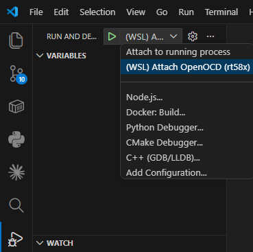

# WSL + OpenOCD + VS Code Debugging Guide

**For RT58x (RT58x/RT584x) Chips and Rafael Matter SDK Development**

---

## Quick Start

```bash
# 1. Windows: Attach debugger to WSL
usbipd attach --wsl --busid <BUSID>

# 2. WSL: Verify device
lsusb | grep "0d28:0204"

# 3. Start OpenOCD
./tools/Debugger/OpenOCD/script/openocd_rt58x.sh <chip>

# 4. VS Code: Press F5 to start debugging
```

> First time? Read sections 2–4 before proceeding.

---

## Table of Contents

1. [System Architecture](#1-system-architecture)
2. [Prerequisites](#2-prerequisites)
3. [Windows: usbipd Setup](#3-windows-usbipd-setup)
4. [WSL: OpenOCD Dependencies](#4-wsl-openocd-dependencies)
5. [Rafael-IoT-SDK Files](#5-rafael-iot-sdk-files)
6. [Firmware Flashing](#6-firmware-flashing)
7. [OpenOCD Startup](#7-openocd-startup)
8. [Debugging Workflow](#8-debugging-workflow)

---

## 1. System Architecture

```
┌────────────────────────────────────────────────────────────┐
│                        Windows Host                        │
│  ┌──────────────┐  ┌──────────────┐  ┌──────────────────┐  │
│  │ CMSIS-DAP    │  │ usbipd-win   │  │ VS Code          │  │
│  │ Debugger     │─▶│ USB Forward  │  │ (Frontend UI)    │  │
│  └──────────────┘  └──────────────┘  └──────────────────┘  │
└───────────────────────────┬────────────────────────────────┘
                            │ Shared USB Port
┌───────────────────────────▼─────────────────────────────────┐
│                    WSL2 (Ubuntu 22.04)                      │
│  OpenOCD (CMSIS-DAP driver + GDB Server on port 50000)      │
│  arm-none-eabi-gdb + VS Code cortex-debug extension         │
└─────────────────────────────────────────────────────────────┘
```

**Flow**: CMSIS-DAP → usbipd → WSL2 → OpenOCD → GDB → VS Code cortex-debug

---

## 2. Prerequisites

### Hardware

- CMSIS-DAP compatible debugger (e.g., DAPLink)
- RT58x/RT584x development board
- USB cable (data, not charge-only)
- SWD wiring: VTref, SWDIO, SWCLK, GND

### Software

> **WSL2 and Windows environment setup**: See [windows_setup.md](./windows_setup.md)

| Component  | Requirement             |
| ---------- | ----------------------- |
| Windows    | 10 (1903+) or 11, WSL2  |
| Ubuntu     | 22.04 LTS (recommended) |
| usbipd-win | Latest                  |
| VS Code    | 1.70.0+                 |

---

## 3. Windows: usbipd Setup

### 3.1 Install usbipd-win

```powershell
# Execute in PowerShell with administrator privileges
winget install usbipd
```

Alternatively, download the `.msi` installer from the [usbipd-win releases page](https://github.com/dorssel/usbipd-win/releases). Restart PowerShell after installation.

### 3.2 Bind and Attach CMSIS-DAP

```powershell
# List USB devices — find the one with VID:PID 0d28:0204
usbipd list

# Bind device (run once)
usbipd bind --busid <BUSID>

# Attach to WSL (run after each unplug/replug)
usbipd attach --wsl --busid <BUSID>
```

> After each USB unplug/replug or device power cycle, re-run `usbipd attach`.

### 3.3 Verify in WSL

```bash
lsusb | grep "0d28:0204"
# Expected: Bus 001 Device 002: ID 0d28:0204 NXP ARM mbed
```

If not visible: confirm `usbipd attach` ran on Windows, check USB cable and power.

---

## 4. WSL: OpenOCD Dependencies

```bash
sudo apt update
sudo apt install -y \
  libusb-1.0-0 \
  libusb-1.0-0-dev \
  libhidapi-hidraw0 \
  libhidapi-dev \
  libjaylink0 \
  libgpiod2 \
  libftdi1-2 \
  libcapstone4
```

### Verify

```bash
dpkg -l | grep -E "libusb|libhidapi|libjaylink"
```

---

## 5. Rafael-IoT-SDK Files

The following directories must be present in your SDK:

```
tools/
└── Debugger/OpenOCD/
    ├── bin/linux/openocd          # OpenOCD executable
    └── script/
        ├── interface/cmsis-dap.cfg
        ├── target/rt58x.cfg
        └── openocd_rt58x.sh
toolchain/arm/Linux/bin/
├── arm-none-eabi-gdb
└── arm-none-eabi-objdump
```

### 5.1 Download ARM GNU Toolchain (Linux, 14.2.rel1)

**Step 1 — Download**

Go to the Arm GNU Toolchain Downloads page:

```
https://developer.arm.com/downloads/-/arm-gnu-toolchain-downloads
```

Under **Version 14.2.Rel1**, find the **x86_64 Linux hosted** section and download:

```
arm-gnu-toolchain-14.2.rel1-x86_64-arm-none-eabi.tar.xz
```

**Step 2 — Extract and place into SDK**

Extract the archive and place its contents so that the SDK directory structure looks like this:

```
toolchain/arm/Linux/
├── bin/
│   ├── arm-none-eabi-gdb
│   └── arm-none-eabi-objdump
├── lib/
├── include/
└── ...
```

> The `bin/` directory must be directly under `toolchain/arm/Linux/`, not inside a subdirectory named after the archive.

**Step 3 — Verify**

```bash
./toolchain/arm/Linux/bin/arm-none-eabi-gdb --version
# Expected: GNU gdb (Arm GNU Toolchain 14.2.Rel1 ...) 14.2.x
```

### Test OpenOCD

```bash
./tools/Debugger/OpenOCD/bin/linux/openocd --version
# Expected: Open On-Chip Debugger 0.12.0
```

**If errors occur:**
- `cannot execute binary file`: Architecture mismatch — ensure using Linux version
- `error while loading shared libraries`: Return to section 4 to install dependencies

---

## 6. Firmware Flashing

Replace `<flash_address>` with the value from the table below.

```bash
./tools/Debugger/OpenOCD/bin/linux/openocd \
  -f ./tools/Debugger/OpenOCD/script/interface/cmsis-dap.cfg \
  -f ./tools/Debugger/OpenOCD/script/target/rt58x.cfg \
  -s ./tools/Debugger/OpenOCD/script \
  -c "program ./out/<project>/<board>/<board>-<project>-example.out <flash_address>" \
  -c "reset run" \
  -c "shutdown"
```

### Flash Addresses

| Chip   | Firmware     |
| ------ | ------------ |
| RT58x  | `0x8000` |
| RT584x | `0x10010000` |

**Example (RT583, lighting-app):**

```bash
  -c "program ./out/lighting-app/RT583/RT583-lighting-app-example.out 0x8000"
```

Success output includes `** Verified OK **`.

---

## 7. OpenOCD Startup

```bash
chmod +x ./tools/Debugger/OpenOCD/bin/linux/openocd
chmod +x ./tools/Debugger/OpenOCD/script/openocd_rt58x.sh

# Start (chip options: rt581/rt582/rt583/rt584h/rt584l/rt584ha4)
./tools/Debugger/OpenOCD/script/openocd_rt58x.sh <chip>
```

Success when you see:
```
Info : Listening on port 50000 for gdb connections
```

> Keep this terminal open during debugging. Stop with `Ctrl + C`.

---

## 8. Debugging Workflow

### Prerequisites

Install the **Cortex-Debug** extension (`marus25.cortex-debug`) from the VS Code Extensions panel before proceeding.

Once OpenOCD is running and the terminal shows `Listening on port 50000 for gdb connections`, start a debug session in VS Code.

### Step 1 — Open Run and Debug

Click the **Run and Debug** icon in the Activity Bar, or press `Ctrl + Shift + D`.

### Step 2 — Select the debug configuration

Click the configuration dropdown at the top of the panel and select **(WSL) Attach OpenOCD (rt58x)**:



> Make sure to select **(WSL) Attach OpenOCD (rt58x)** and not `Attach to running process` or any other entry.

### Step 3 — Select Board type and project

| Prompt | Description | Options |
| ------ | ----------- | ------- |
| **Rafael board type** | Target chip variant | `RT583`, `RT584H`, `RT584L`, `RT584HA4` |
| **Which example do you want to debug?** | Example application to debug | `lighting-app`, `lock-app`, `contact-sensor-app`, … |

### Step 4 — Confirm connection

When the session starts successfully, the VS Code status bar switches to debug mode and execution pauses at `main()`. You can now set breakpoints, step through code, and inspect variables.
