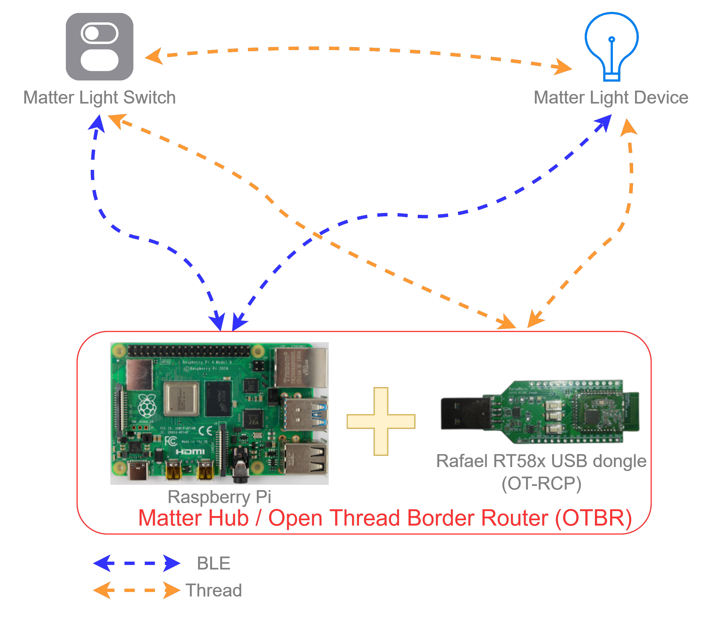

# Matter over thread demo overview

The basic concepts for the Matter application demo will be descripted in this section, including the hardware and software requirements. To setup a Matter demo environment, we using the Open Thread Border Router (OTBR) and the chip-tool running on a Raspberry Pi. The users can build the Raspberry Pi imgae consisted the chip-tool on their own or using the image provided by the Rafael Micro, we also provide the Open Thread Radio Co-Processor (OT-RCP) image for the RT58x USB dongle, with the Raspberry Pi and the OT-RCP dongle as the Matter Hub. The related image files can be download from [Rafael Customer Support Portal](https://support.rafaelmicro.com:8088/).



Above figure shows a Matter lighting application demo, including a Matter Light and the Switch devices, the Light and Switch device images can be built from this github repository following the [image build instruction](./matter_env_setup.md).

# Join a Matter device and control it

Using CHIP Tool for Matter device testing on the OTBR(Matter hub), Setup step:

1.  **Prepare the Rafael Matter device**: The user can power on the Light or Switch device here.
2.  **Enable Bluetooth LE advertising on Matter device**: The Matter device will be
    configured to advertise automatically on boot.
3.  **Make sure the IP network is set up**: To follow the next steps, the IP
    network must be up and running on the OTBR.
4.  **Determine network pairing credentials** SSH to the OTBR and with the following commmand to get the Thread network credentials:
    ```
    $ sudo ot-ctl dataset active -x
    ```
    The terminal will return the message as following:
    ```
    0e080000000000010000000300001335060004001fffe002084fe76e9a8b5edaf50708fde46f999f0698e20510d47f5027a414ffeebaefa92285cc84fa030f4f70656e5468726561642d653439630102e49c0410b92f8c7fbb4f9f3e08492ee3915fbd2f0c0402a0fff8
    Done
    ```
    where the `0e080000000000010000000300001335060004001fffe002084fe76e9a8b5edaf50708fde46f999f0698e20510d47f5027a414ffeebaefa92285cc84fa030f4f70656e5468726561642d653439630102e49c0410b92f8c7fbb4f9f3e08492ee3915fbd2f0c0402a0fff8` is the thread Operational Dataset, please copy this Dataset for the step 6.
    
5.  **Determine Matter device’s discriminator and setup PIN code**: The default Matter device
    **discriminator** is `3840` and **PIN code** is `20202021`
6.  **Commission Matter device into existing IP network**: Commissioning into
    Thread network over Bluetooth LE: To commission the device to the existing
    Thread network, use the following command pattern:
    ```
    $ chip-tool pairing ble-thread <node_id> hex:<operational_dataset> <pin_code> <discriminator>
    ```
    > <node_id> is the user-defined ID of the node being commissioned.
    > <operational_dataset> is the Operational Dataset determined in the step 4.
    > <pin_code> and <discriminator are device-specific keys determined in the
    > step 5.

    so the command will be like:
    ```
    $ chip-tool pairing ble-thread 1001 hex:0e080000000000010000000300001335060004001fffe002084fe76e9a8b5edaf50708fde46f999f0698e20510d47f5027a414ffeebaefa92285cc84fa030f4f70656e5468726561642d653439630102e49c0410b92f8c7fbb4f9f3e08492ee3915fbd2f0c0402a0fff8 20202021 3840

    ```
    After this command, the Matter device will start the commissioning process and when the join network process is successed, the user can now control the device (i.e.: Light device) with the following steps. 
7.  **Control application Data Model clusters** Use the following command
    pattern to toggle the Matter Light state:
    ```
    $ chip-tool onoff toggle <node_id> <endpoint_id>
    ```
    > <node_id> is the user-defined ID of the commissioned node. <endpoint_id>
    > is the ID of the endpoint with OnOff cluster implemented.
    
    example:
    ```
    $ chip-tool onoff toggle 1001 1
    ```
