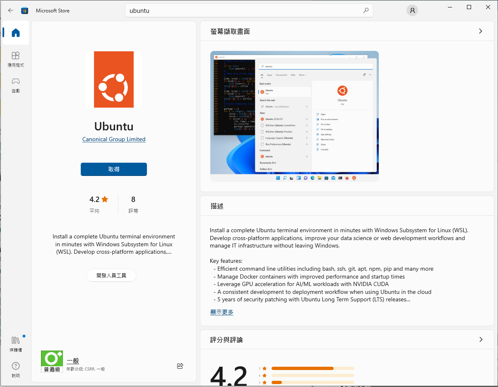
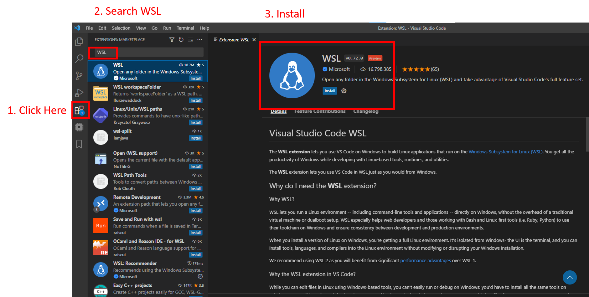
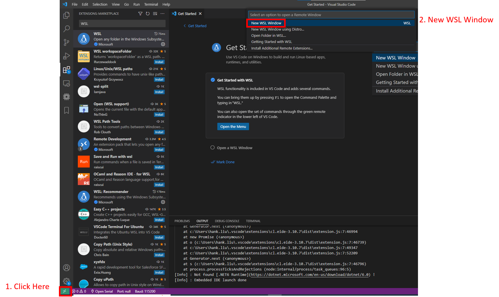

# Building Matter For Windows

## Pre-request

- Make sure your System Disk (C:/) has 30GB of space to set up the
  environment. (include Matter source code)
- Visual Studio Code: [Download](https://code.visualstudio.com/Download)
- Download Ubuntu from Microsoft Store!



## Check Windows pre-request

> **Note**: '$' means this command run on a Linux terminal, others run on
> PowerShell

### Check WSL installed:

- Check WSL in your windows, open PowerShell run:

  ```
  wsl
  ```

  **If you get the command not found message, you need to activate WSL in
  Windows. Please follow
  [Microsoft install WSL document](https://learn.microsoft.com/zh-tw/windows/wsl/install-manual)
  (NOTE: Please ignore the Windows version check, sometimes the newer version
  also didn't supports "Windows Virtual Machine feature")**

### Setting Windows environment:

- Make sure the WSL's version is version 2, so we update WSL: (This command
  run with administrator PowerShell)
  ```
  wsl --install
  ```
- Set default WSL to WSL2 (This command run with administrator PowerShell)
  ```
  wsl --set-default-version 2
  ```
- Launch Ubuntu on WSL (This command run with administrator PowerShell)
  `wsl --install -d Ubuntu` **Here you need to reopen your PowerShell**
- Check WSL version:
  ```
  wsl --list --verbose
  NAME      STATE           VERSION
  * Ubuntu    Running         1
  ```
- **If your "VERSION" is still in version 1**, set it to version 2: Setting
  Ubuntu's WSL version to WSL2
  ```
  wsl --set-version Ubuntu 2
  ```
- Check WSL version again:
  ```
  wsl --list --verbose
  NAME      STATE           VERSION
  * Ubuntu    Stopped         2
  ```

### Activate WSL2

- open VScode and install some extensions for developing the environment
  - WSL (ms-vscode-remote.remote-wsl)



- Using the lower left icon (like this ><) and select the new WSL window
  - Now the vscode terminal will be a Linux terminal (like this
    sw@DESKTOP-JNHERQ8:~$)



---

## Building Matter

Once the WSL environment is ready, follow the build instructions in
[linux_macos_setup.md](./linux_macos_setup.md) (Linux section).
