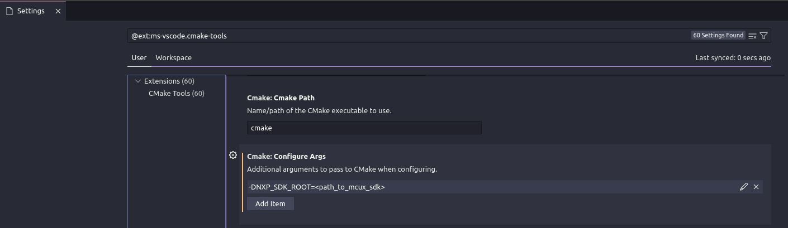
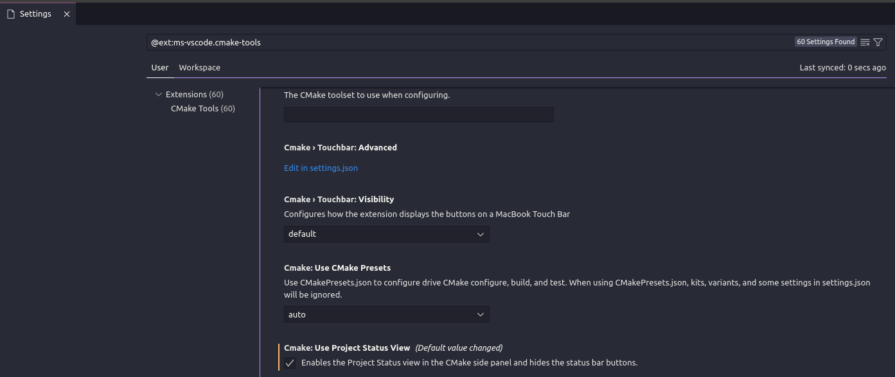
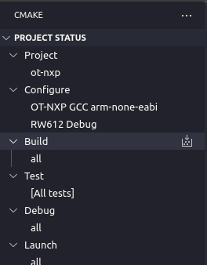
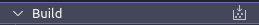
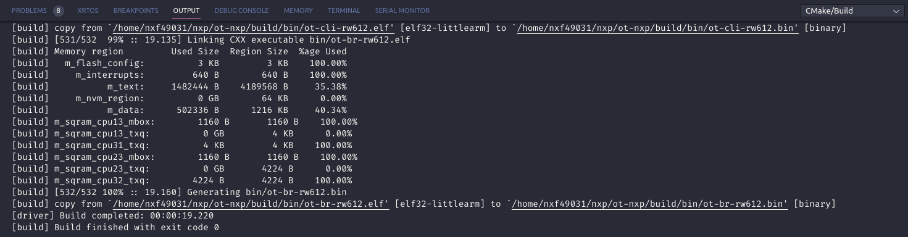
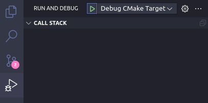
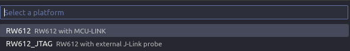
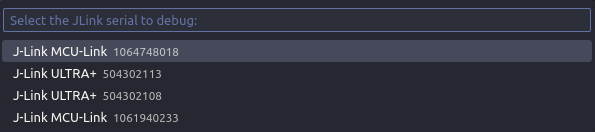
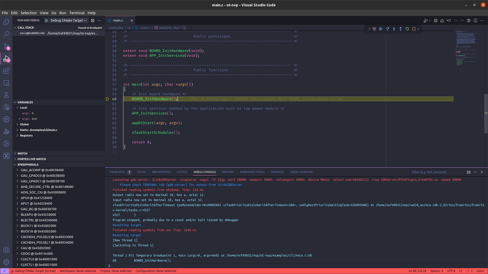

# VS Code integration of OT-NXP

OT-NXP provides several configuration files for VS Code to allow the user to build and debug NXP examples easily.

All those files are located in the `.vscode` folder at the root of the repository.

Let's take a look at its content:

- `extensions.json`: this file provides a list of the recommended extensions to install in your environment to fully take advantage of the integration with VS Code. Without those extension, the build and launch configuration may not work properly, or even not at all.
- `settings.json`: this file provides a few basic settings, especially to configure correctly the CMake Tools extension for OT-NXP.
- `cmake-kits.json`: this file is used with the CMake Tools extension. It allows the user to select the custom toolchain kit provided by OT-NXP with the CMake Tools extension. It's highly recommended to use this kit when building OT-NXP examples, otherwise the build may not be successful.
- `cmake-variants.yaml`: this file is used with the CMake Tools extension. It allows the user to select between different build variant of the OT-NXP examples, especially the target platform and the build type (debug, release,...)
- `tasks.json`: this file provides a few QoL tasks the user can use along its development. As an example, the task `Find J-Link probes` can be used to find all the J-Link devices connected to the computer and generate a jlink_setup.cfg file accordingly (details below).
- `launch.json`" this file provides a few launch/debug configuration, allowing the user to start a debug session of the current CMake target selected by the CMake Tools extension.
- `configs`: this folder provides several files which contain information about the NXP platforms, useful for the launch configurations.
  - `svd`: this folder contains the SVD files of supported NXP platforms, they will be loaded during the debug session so the user can read the peripherals registers.
  - `find_jlink_probes.py`: this Python script is used with the `Find J-Link probes` tasks to find all the J-Link probes connected to the computer. It will also use the `get_serial_numbers.jlink` file, which is a J-Link command file.
  - `platforms.json`: this is a file used when launching a debug session, it gives several information on the supported NXP platform needed by the cortex-debug extension.
  - `jlink_setup_example.cfg`: this file provides an example of how the jlink_setup.cfg should be filled by the user (if not using the `Find J-Link probes` task).

## Build OT-NXP examples with VS Code

In order to be able to build the OT-NXP examples with VS Code, the `ms-vscode.cmake-tools` extension is mandatory. Also, it is assumed the user installed the `arm-none-eabi` toolchain, either manually or by using the bootstrap script. It is recommended to have this toolchain in your PATH.

### Initial CMake Tools configuration

The OT-NXP examples are built using the MCUXPRESSO SDK, either as an internal development repo, a package or the public github repo.
The path to this SDK is provided to the build system with the CMake flag `NXP_SDK_ROOT`. This flag is very user dependent, so the user will have to specify it as a configure argument in the CMake Tools extension settings:

Also, the CMake Tools extension provides two different way to interact with the current CMake project, it can be displayed in the dedicated CMake side panel, or in the status bar. This is controlled by the setting `CMake: Use Project Status View`. The next steps of this tutorial will assume this setting is enabled.

### Configure and Build

1. Open the CMake side panel to see the current Project Status
2. In `Project`, make sure to select the OT-NXP folder (depends on your workspace)
3. In `Configure`, make sure to select the OT-NXP arm-none-eabi cmake-kit provided with the repo
4. In `Configure`, select the variant you want to build
5. You should have something similar to this view:

6. Hit the configure button to run the CMake project configuration

7. If the configuration is successful, you can hit the build button to build the project

8. You should obtain a similar result:

## Debug OT-NXP examples with VS Code

OT-NXP provides a generic infrastructure which allows to debug with the VS Code debugger directly on target using J-Link.

The following extension are mandatory in order to make this work, make sure to install them before going further:

- `ms-vscode.cmake-tools`
- `marus25.cortex-debug`
- `rioj7.command-variable`

We highly recommend to install the following extension to improve the debug experience:

- `mcu-debug.rtos-views`
- `mcu-debug.memory-view`
- `ms-vscode.vscode-serial-monitor`

> Note: It is also assumed the user installed J-Link and that this J-Link version supports the target platform.

> Note 2: Python 3.x will also be needed, so it is assumed the user already has it setup

### Initial setup

The launch configurations provided in OT-NXP rely on a file `jlink_setup.cfg`, which describes the different J-Link targets, associating nicknames to serial numbers. When launching the debug configuration, the user will be asked to select a target device based on those information.

Initially, this file doesn't exist in the repo, this file must be provided by the user. There are currently two methods to do so: either manually or by using the task `Find J-Link probes`.

The recommended method is using the provided task. This task will invoke a python script that will retrieve all the J-Link probes connected to the computer and will then generate the file.
To run it, go to `Terminal -> Run Task... -> Find J-Link probes`.

For the manual method, refer to `.vscode/configs/jlink_setup_example.cfg` which describes how the file must be filled.

### Launch a debug session

To start a debug session, the user must first select which launch configuration to use. OT-NXP provides two configurations:

- `Debug CMake Target`: this configuration will download the CMake launch target to the target device and start a debugging session using the VS Code debugger.
- `Attach CMake Target`: this configuration only attaches the debugger to a running target, and will load the debug info from the CMake launch target

The user is free to add his own launch configuration if needed.

Let's run the `Debug CMake Target` configuration.

1. Select the `Debug CMake Target` configuration from the `Run and Debug` side panel is the drop down menu, then hit the `Start Debugging` button

2. You will be asked to select a platform among the supported OT-NXP platforms

3. Then you will be asked to select which connected J-Link device you want to debug

4. After the flashing step is complete, the debugging session will be started and it will break into the main function

