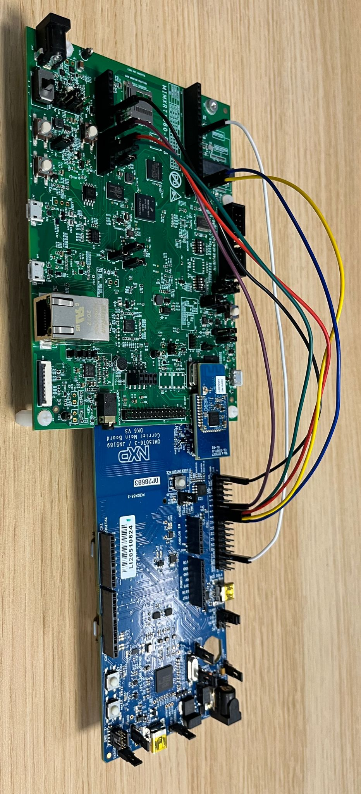
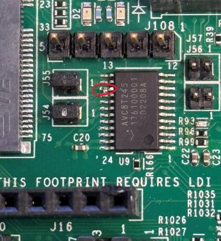
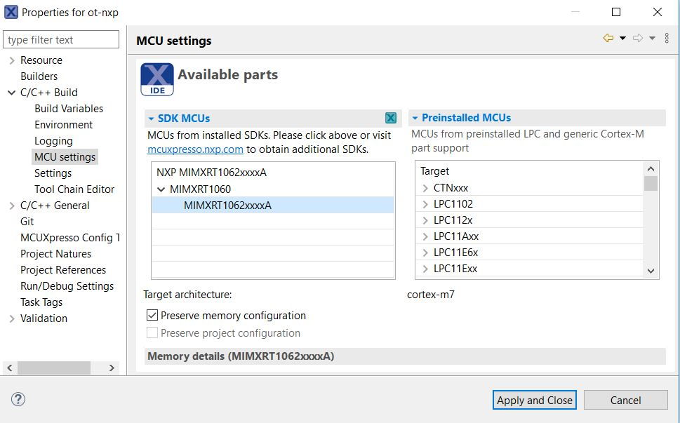
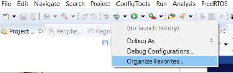

# OpenThread on NXP RT1060 (host) + transceiver (rcp) example

This directory contains example platform drivers for the [NXP RT1060][rt1060]
platform.

The example platform drivers are intended to present the minimal code necessary
to support OpenThread. As a result, the example platform drivers do not
necessarily highlight the platform's full capabilities.

[rt1060]: https://www.nxp.com/products/processors-and-microcontrollers/arm-microcontrollers/i-mx-rt-crossover-mcus/i-mx-rt1060-crossover-mcu-with-arm-cortex-m7-core:i.MX-RT1060

## Configuration(s) supported

Here are listed configurations that allow to support Openthread on RT1060:

- RT1060 + K32W0
- **Experimental** RT1060-EVKC + IWX12

## Prerequisites

Before you start building the examples, you must download and install the
toolchain and the tools required for flashing and debugging.

## Toolchain

OpenThread environment is suited to be run on a Linux-based OS.

In a Bash terminal (found, for example, in Ubuntu OS), follow these instructions
to install the GNU toolchain and other dependencies.

```bash
$ cd <path-to-ot-nxp>
$ ./script/bootstrap
```

## Tools

- Download and install the [MCUXpresso IDE][mcuxpresso ide].

[mcuxpresso ide]: https://www.nxp.com/support/developer-resources/software-development-tools/mcuxpresso-software-and-tools/mcuxpresso-integrated-development-environment-ide:MCUXpresso-IDE

- Download the NXP MCUXpresso git SDK
  and associated middleware from GitHub using the west tool.

```
bash
$ cd third_party/github_sdk/sdk_2.15.1
$ west init -l manifest --mf west.yml
$ west update
```

In case there are local modifications to the already installed git NXP SDK. Use the west forall command instead of the west init to reset the west workspace before running the west update command. Warning: all local changes will be lost after running this command.

```
bash
$ cd third_party/github_sdk/sdk_2.15.1
$ west forall -c "git reset --hard && git clean -xdf" -a
```

## Hardware requirements

### RT1060 + K32W0

Host part:

- 1 MIMXRT1060-EVKB

Transceiver part:

- 1 OM15076-3 Carrier Board (DK6 board)
- 1 K32W061 Module to be plugged on the Carrier Board

Note : The pin connections between the boards are slightly different according
to which version of the board is used (MIMXRT1060-EVKB or EVK-MIMXRT1060).The
different settings are described below.

#### Board settings (Spinel over UART)

The below table explains pin settings (UART settings) to connect the
evkbmimxrt1060 (host) to a k32w061 transceiver (rcp).

|    PIN NAME    | DK6 (K32W061) | I.MXRT1060-EVKB | I.MXRT1060-EVK | PIN NAME OF RT1060 | GPIO NAME OF RT1060 |
| :------------: | :-----------: | :-------------: | :------------: | :----------------: | :-----------------: |
|    UART_TXD    |  PIO, pin 8   |   J16, pin 1    |   J22, pin 1   |    LPUART3_RXD     |    GPIO_AD_B1_07    |
|    UART_RXD    |  PIO, pin 9   |   J16, pin 2    |   J22, pin 2   |    LPUART3_TXD     |    GPIO_AD_B1_06    |
|    UART_RTS    |  PIO, pin 6   |   J33, pin 3    |   J23, pin 3   |    LPUART3_CTS     |    GPIO_AD_B1_04    |
|    UART_CTS    |  PIO, pin 7   |   J33, pin 4    |   J23, pin 4   |    LPUART3_RTS     |    GPIO_AD_B1_05    |
|      GND       |   J3, pin 1   |   J32, pin 7    |   J25, pin 7   |         XX         |         XX          |
|     RESET      |     RSTN      |   J33, pin 2    |   J23, pin 2   |   GPIO_AD_B1_11    |    GPIO_AD_B1_11    |
| DIO5/ISP Entry |  PIO, pin 5   |   J33, pin 1    |   J23, pin 1   |   GPIO_AD_B1_10    |    GPIO_AD_B1_10    |

The below picture shows pins connections for the EVK-MIMXRT1060.



#### Generating a K32W0 OT-RCP transceiver image

To target a RT1060 + K32W0 configuration, before building any Openthread host applications, it is required to generate a K32W0 RCP image.
To know how to build an Openthread K32W0 application it is recommended to follow the [K32W061
Readme][k32w061-readme].

To avoid to have to rebuild all K32W061 application, it is recommended to build only the ot_rcp version using the below command:

```bash
$ ./script/build_k32w061 ot_rcp_only_uart_flow_control
```

After a successful build, application binaries will be generated in
`ot-nxp/build_k32w061/rcp_only_uart_flow_control/bin` and would contain the file called "rcp_name.bin.h" that would be used by the RT1060 to download the K32W061 RCP firmware. In fact the RT1060 host application is in charge of storing the K32W0 firmware in its flash to be able to use the `The Over The Wire (OTW) protocol (over UART)` to download (at host startup) the k32w0 transceiver image from the host to the K32W0 internal flash. For more information on the k32w0 OTW protocol, user can consult the doxygen header of the file located in `<ot_nxp>/third_party/rt1060_sdk/repo/middleware/wireless/framework/OTW/k32w0_transceiver/fwk_otw.c`.

[k32w061-readme]: ../../k32w0/k32w061/README.md
[sdk_mcux]: https://mcuxpresso.nxp.com/en/welcome

### Experimental RT1060-EVKC + IWX12

#### Hardware requirements RT1060-EVKC + IW612

Host part:

- 1 MIMXRT1060-EVKC

  Hardware should be reworked as below:

  - populate R93, R96, R2155, R2156, R2157, R2158, R2159 with 0Ohm resistors
  - J76 and J107 jumpers in 2-3 position.
  - J109 and J110 jumpers in 1-2 position.
  - disconnect pin15 of component U9




Transceiver part :

- 1 IW612 ( Firecrest) 2EL M.2 Module (rev A1)

The Iw612 module should be plugged to the M.2 connector on RT1060-EVKC board.

## Building examples

### Building all targets

The build script located in `<ot_nxp_repo>/script/build_rt1060` allows to build various openthread application targeted to run on RT1060 platform.
By default if no argument is given when running the script will generate all binaries for each supported configuration.

To build application only for a particular configuration, you should follow the next dedicated section.

Note: to target the RT1060 + K32W0 configuration, before building any Openthread host applications make sure to have correctly generated a K32W0 RCP binary.

```bash
$ cd <path-to-ot-nxp>
$ git submodule update --init
$ ./script/build_rt1060
```

### Building only RT1060+k32W0 applications

Supported application(s):

1. OT CLI application

- app_name: `k32w0_uart_flow_control`
- Description: The target application will be an openthread CLI running on freeRTOS and include support of the FTD (Full Thread Device) role. In the mode the host and the K32W0 transceiver will exchange message over a UART interface with flow control.
- Status: fully supported

2. Border Router application with Ethernet:

- app_name: `k32w0_uart_flow_control_br_ethernet`
- Description: The target application will be an openthread CLI running on freeRTOS and include support of the FTD (Full Thread Device) role. It also supports Border Rouder role over Ethernet.
- Status: Fully supported

How to build them ?

```bash
$ cd <path-to-ot-nxp>
$ ./script/build_rt1060 <app_name> #example: ./script/build_rt1060
```

Note : The option `-DOT_NXP_TRANSCEIVER_BIN_PATH=/home/k32w0_rcp.h` could be added to indicate the path of the k32w0 transceiver to use. If not set, the binary file located in "<ot_nxp>/build_k32w061/rcp_only_uart_flow_control/bin/ot-rcp.elf.bin.h" will be used.

```bash
$ ./script/build_rt1060 <app_name> -DOT_NXP_TRANSCEIVER_BIN_PATH=/home/k32w0_rcp.h
```

Note : If the EVK-MIMXRT1060 board is used instead of MIMXRT1060-EVKB, make sure
to specify it using the following build command :

```bash
$ ./script/build_rt1060 <app_name> -DEVK_RT1060_BOARD="evkmimxrt1060"
```

After a successful build, the generated binary can be found in
`build_rt1060/<app_name>/bin`.

### Building only RT1060+IW612 applications

Supported application(s):

1. OT CLI application

- app_name: `iwx12_spi`
- Description: The target application will be an openthread CLI running on freeRTOS and include support of the FTD (Full Thread Device) role. In the mode the host and the IWX12 transceiver will exchange message over a SPI interface.
- Status: Fully supported

2. Border Router application with Wi-Fi:

- app_name: `iwx12_spi_br_wifi`
- Description: The target application will be an openthread CLI running on freeRTOS and include support of the FTD (Full Thread Device) role. It also supports Border Rouder role over Wi-Fi.
- Status: Fully supported

3. Border Router application with Ethernet:

- app_name: `iwx12_spi_br_ethernet`
- Description: The target application will be an openthread CLI running on freeRTOS and include support of the FTD (Full Thread Device) role. It also supports Border Rouder role over Ethernet.
- Status: Fully supported

How to build them ?

```bash
$ cd <path-to-ot-nxp>
$ ./script/build_rt1060 <app_name> #example: ./script/build_rt1060
```

After a successful build, the generated binary can be found in
`build_rt1060/<app_name>/bin`.

## Example: Flashing the IMXRT Openthread rt1060 image using MCUXpresso IDE

In order to flash the application for debugging we recommend using
[MCUXpresso IDE (version >= 11.3.1)](https://www.nxp.com/design/software/development-software/mcuxpresso-software-and-tools-/mcuxpresso-integrated-development-environment-ide:MCUXpresso-IDE?tab=Design_Tools_Tab).

- Import the previously downloaded NXP SDK into MCUXpresso IDE. This can be
  done by drag-and-dropping the SDK archive into MCUXpresso IDE.

- Import ot-nxp repo in MCUXpresso IDE as Makefile Project. Use _none_ as
  _Toolchain for Indexer Settings_:

```
File -> Import -> C/C++ -> Existing Code as Makefile Project
```

- Configure MCU Settings:

```
Right click on the Project -> Properties -> C/C++ Build -> MCU Settings -> Select MIMXRT1060 -> Apply & Close
```



- Configure the toolchain editor:

```
Right click on the Project -> C/C++ Build-> Tool Chain Editor -> NXP MCU Tools -> Apply & Close
```


- Create a debug configuration:

To create a new debug configuration for our application, we will duplicate an
existing debug configaturation.

- Create a debug configuration for the hello word projet

1. Click on "Import SDK example(s)..." on the bottom left window of MCUXpresso.
2. Select the "evkbmimxrt1060" SDK, click on "Next"
3. Expand "demo_apps", select the "hello_word" example, click on next and then
   finish.
4. Build the imported "Hello word" application by right clicking on the project
   and select "Build Project".
5. Right click again on the project and select "Debug As" and click on
   "MCUXpresso IDE LinkServer" option. Doing this will flash the application on
   the board. Then click on the red "Terminate" button.

- Duplicate the hello word debug configaturation to create a new debug
  configuration for the ot_cli

1. Right click on the "Hello Word" project, select "Debug As" and then select
   "Debug Configurations".
2. Right click on the "Hello Word" debug configuration and click on "Duplicate".
3. Rename the Duplicated debug configuration "ot-cli".
4. In the "C/C++ Application", click on "Browse" and select the ot-cli-rt1060.elf
   app for the application targeted. Then click on
   Apply and Save.
5. Click on "Organize Favorites".
   
6. Add the ot-cli debug configuration
7. Run the ot-cli debug configuration

[cmsis-dap]: https://os.mbed.com/handbook/CMSIS-DAP

## Running the example

1. The CLI example uses UART connection. To view raw UART output, start a
   terminal emulator like PuTTY and connect to the used COM port with the
   following UART settings (on the IMXRT1060):

   - Baud rate: 115200
   - 8 data bits
   - 1 stop bit
   - No parity
   - No flow control

2. Follow the process describe in [Interact with the OT CLI][validate_port].

[validate_port]: https://openthread.io/guides/porting/validate-the-port#interact-with-the-cli

For a list of all available commands, visit [OpenThread CLI Reference
README.md][cli].

[cli]: https://github.com/openthread/openthread/blob/master/src/cli/README.md
