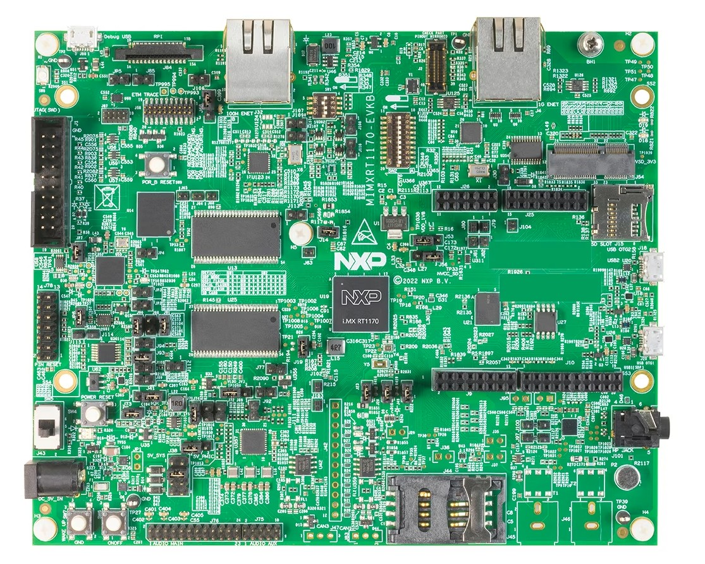
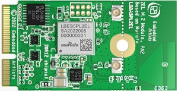
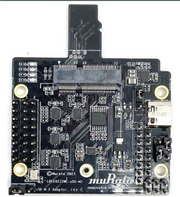
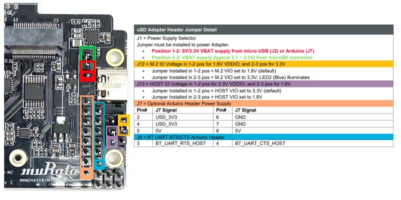
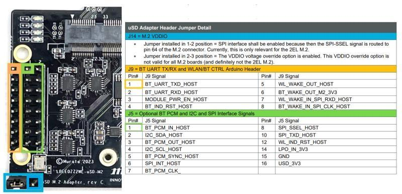

# OpenThread on NXP RT1170 (host) + transceiver (rcp) example

This directory contains example platform drivers for the [NXP RT1170][rt1170] platform.

The example platform drivers are intended to present the minimal code necessary to support OpenThread. As a result, the example platform drivers do not necessarily highlight the platform's full capabilities.

[rt1170]: https://www.nxp.com/products/processors-and-microcontrollers/arm-microcontrollers/i-mx-rt-crossover-mcus/i-mx-rt1170-crossover-mcu-family-first-ghz-mcu-with-arm-cortex-m7-and-cortex-m4-cores:i.MX-RT1170?cid=ad_PRG4692582_TAC476846_EETECH_IMXRT1170&gclid=EAIaIQobChMIvr3xrYzT8QIVTgKLCh3GGQ80EAAYAiAAEgLnYvD_BwE

## Configuration(s) supported

Here are listed configurations that allow to support Openthread on RT1170:

- RT1170 + IWX12

## Prerequisites

Before you start building the examples, you must download and install the toolchain and the tools required for flashing and debugging.

## Toolchain

OpenThread environment is suited to be run on a Linux-based OS.

In a Bash terminal (found, for example, in Ubuntu OS), follow these instructions to install the GNU toolchain and other dependencies.

```bash
$ cd <path-to-ot-nxp>
$ git submodule update --init
$ ./script/bootstrap
```

## Tools

- Download and install the [MCUXpresso IDE][mcuxpresso ide].

[mcuxpresso ide]: https://www.nxp.com/support/developer-resources/software-development-tools/mcuxpresso-software-and-tools/mcuxpresso-integrated-development-environment-ide:MCUXpresso-IDE

- Download the NXP MCUXpresso git SDK
  and associated middleware from GitHub using the west tool.

```
bash
$ cd third_party/github_sdk/sdk_2.15.1
$ west init -l manifest --mf west.yml
$ west update
```

In case there are local modifications to the already installed git NXP SDK. Use the west forall command instead of the west init to reset the west workspace before running the west update command. Warning: all local changes will be lost after running this command.

```
bash
$ cd third_party/github_sdk/sdk_2.15.1
$ west forall -c "git reset --hard && git clean -xdf" -a
```

## Hardware requirements

### RT1170 + IWX12

Host part:

- 1 EVKB-MIMXRT1170
  

Transceiver part:

Transceiver parts :

- 1 [2EL M2 A1 IW612 Secure Module](https://www.nxp.com/products/wireless/wi-fi-plus-bluetooth-plus-802-15-4/2-4-5-ghz-dual-band-1x1-wi-fi-6-802-11ax-plus-bluetooth-5-2-plus-802-15-4-tri-radio-solution:IW612)



- 1 [Murata uSD to M2 adapter revC](https://www.murata.com/en-eu/products/connectivitymodule/wi-fi-bluetooth/overview/lineup/usd-m2-adapter-2we-2wf)



- Male to female Burg cables

#### Hardware rework for SPI support on EVKB-MIMXRT1170

To support SPI on the EVKB-MIMXRT1170 board, it is required to remove 0Ω resistors R404,R406.

#### Board settings (Spinel over SPI)

- Plug IW612 Firecrest module to M.2 connector on Murata uSD to M2 adapter
- Murata uSD to M2 adapter connections description:





- Jumpers positions on Murata uSD to M2 adapter:

  Use USB-C power supply

  |      Jumper       | Position |
  | :---------------: | :------: |
  |        J1         |   1-2    |
  |        J12        |   1-2    |
  |        J13        |   1-2    |
  |        J14        |   1-2    |
  | JP1.1 (back side) |    ON    |

- Jumpers positions on MIMXRT1170-EVKB:

  | Jumper | Position |
  | :----: | :------: |
  |  J56   |   2-3    |

- I2C connection to program IO-Expander on the IW612 module

  | MIMXRT1170-EVKB  | uSD-M2 adapter |
  | :--------------: | :------------: |
  | I2C_SDA (J10.18) |      J5.2      |
  | I2C_SDL (J10.20) |      J5.4      |

- SPI connection between RT1170 and uSD-M2 adapter

  |  MIMXRT1170-EVKB  | uSD-M2 adapter |
  | :---------------: | :------------: |
  | SPI_MOSI (J10.8)  |     J5.10      |
  | SPI_MISO (J10.10) |      J9.7      |
  | SPI_CLK (J10.12)  |      J9.8      |
  |  SPI_CS (J10.6)   |      J5.8      |
  |  SPI_INT (J26.4)  |      J5.6      |
  |   GND (J10.14)    |     J5.15      |

- Reset line connection between RT1170 and uSD-M2 adapter

  | MIMXRT1170-EVKB | uSD-M2 adapter |
  | :-------------: | :------------: |
  |  RESET (J26.2)  |      J9.3      |
  |   GND (J26.1)   |      J7.6      |

## Building examples

The build script located in `<ot_nxp_repo>/script/build_rt1170` allows to build various openthread application targeted to run on RT1060 platform.
By default if no argument is given when running the script will generate all binaries for each supported configuration.

To build application only for a particular configuration, you should follow the next dedicated section.

```bash
$ cd <path-to-ot-nxp>
$ ./script/build_rt1170
```

### Building only RT1170+IWX12 applications

1. OT CLI application

- app_name: `iwx12_spi`
- Description: The target application will be an openthread CLI running on freeRTOS and include support of the FTD (Full Thread Device) role. In the mode the host and the IWX12 transceiver will exchange message over a SPI interface.
- Status: Fully supported

2. Border Router application with Wi-Fi:

- app_name: `iwx12_spi_br_wifi`
- Description: The target application will be an openthread CLI running on freeRTOS and include support of the FTD (Full Thread Device) role. It also supports Border Rouder role over Wi-Fi.
- Status: Fully supported

3. Border Router application with Ethernet:

- app_name: `iwx12_spi_br_ethernet`
- Description: The target application will be an openthread CLI running on freeRTOS and include support of the FTD (Full Thread Device) role. It also supports Border Rouder role over Ethernet ( use J4 ETH connector ).
- Status: Fully supported

How to build them ?

```bash
$ cd <path-to-ot-nxp>
$ ./script/build_rt1170 <app_name> #example: ./script/build_rt1170 iwx12_spi
```

After a successful build, the generated binary can be found in
`build_rt1170/<app_name>/bin`.

## Example: Flashing the IMXRT Openthread rt1170 image using MCUXpresso IDE

In order to flash the application for debugging we recommend using [MCUXpresso IDE (version >= 11.3.1)](https://www.nxp.com/design/software/development-software/mcuxpresso-software-and-tools-/mcuxpresso-integrated-development-environment-ide:MCUXpresso-IDE?tab=Design_Tools_Tab).

- Import the previously downloaded NXP SDK into MCUXpresso IDE. This can be done by drag-and-dropping the SDK archive into MCUXpresso IDE.
- Follow the same procedure as described in [OpenThread on RT1060 examples][rt1060-page] in section "## Example: Flashing the IMXRT Openthread rt1060 image using MCUXpresso IDE". Instead of selecting the RT1060 MCU, the RT1170 MCU should be chosen.

[rt1060-page]: ../rt1060/README.md

## Running the example

1. The CLI example uses UART connection. To view raw UART output, start a terminal emulator like PuTTY and connect to the used COM port with the following UART settings (on the IMXRT1170):

   - Baud rate: 115200
   - 8 data bits
   - 1 stop bit
   - No parity
   - No flow control

2. Follow the process describe in [Interact with the OT CLI][validate_port].

[validate_port]: https://openthread.io/guides/porting/validate-the-port#interact-with-the-cli

For a list of all available commands, visit [OpenThread CLI Reference README.md][cli].

[cli]: https://github.com/openthread/openthread/blob/master/src/cli/README.md

## Known issues

- Factory reset issue when the board is attacted to MCUXpresso debugguer: before running the factory reset command the debugguer needs to be detached.
