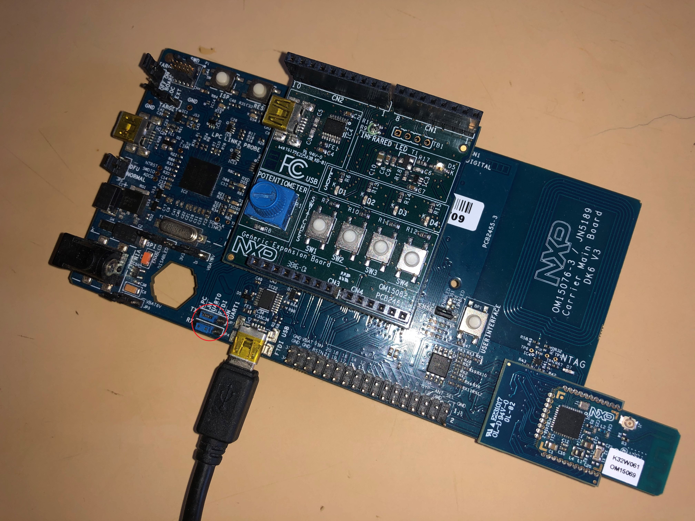
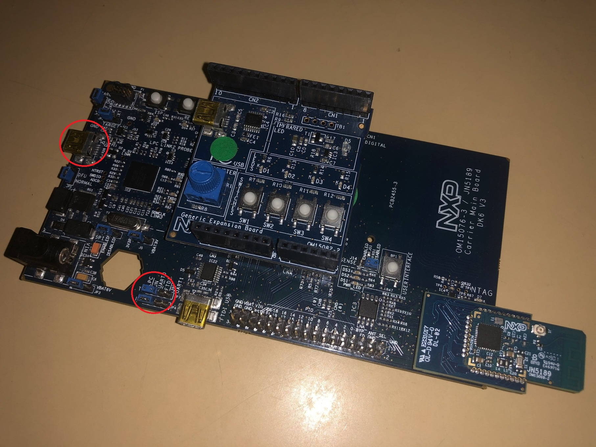
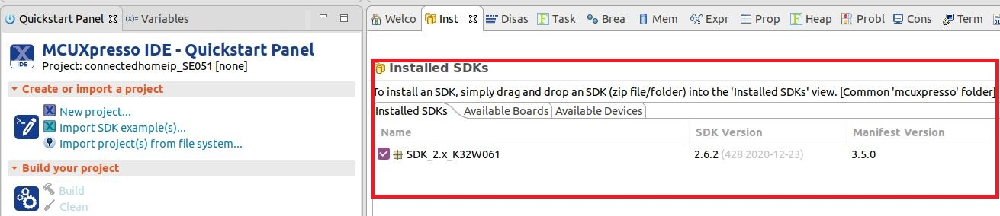
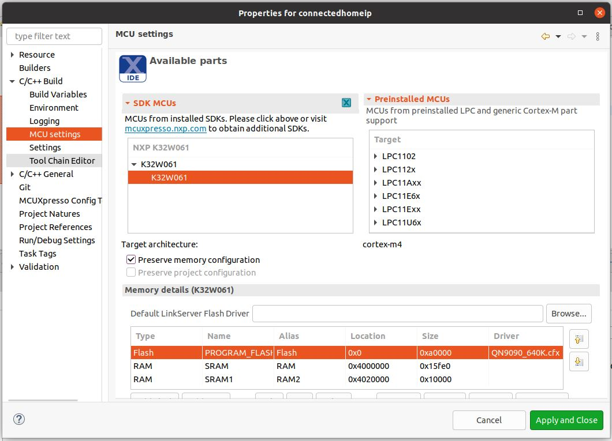
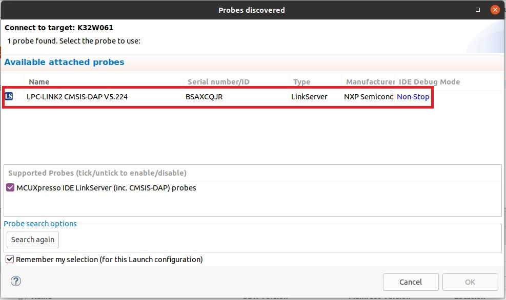
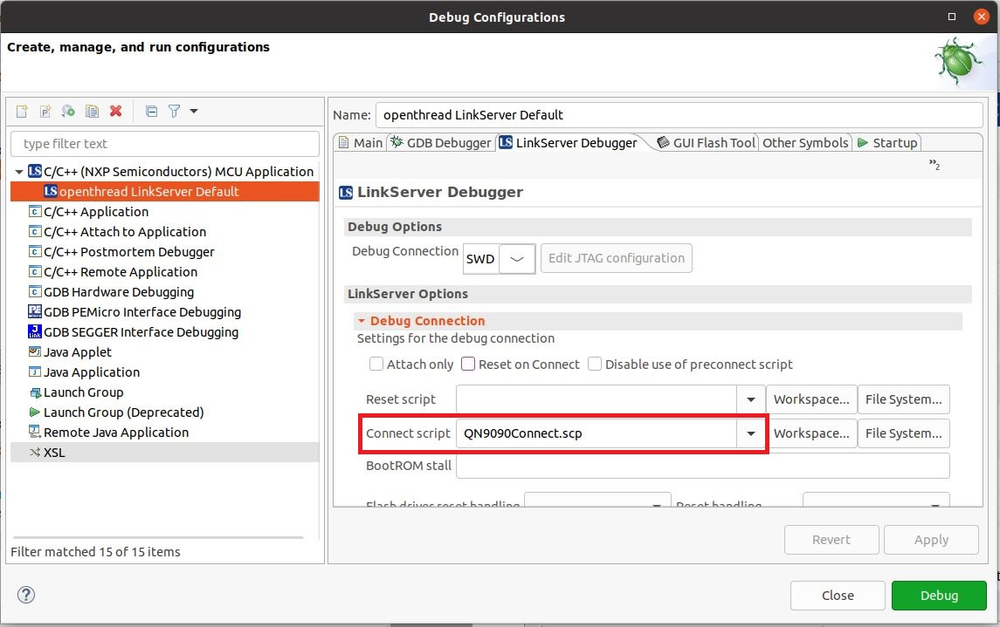
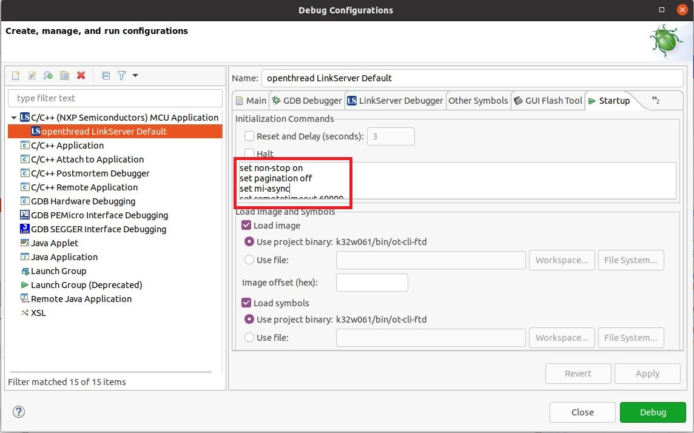
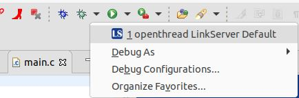

# OpenThread on NXP K32W061 Example

This directory contains example platform drivers for the [NXP K32W0x1][k32w0x1]
based on [K32W0x1-DK006][k32w0x1-dk006] hardware platform, including all
variants of devices like K32W041 and K32W061.

The example platform drivers are intended to present the minimal code necessary
to support OpenThread. As a result, the example platform drivers do not
necessarily highlight the platform's full capabilities.

[k32w061]: https://www.nxp.com/products/wireless/thread/k32w061-41-high-performance-secure-and-ultra-low-power-mcu-for-zigbeethread-and-bluetooth-le-5-0-with-built-in-nfc-option:K32W061_41
[k32w061-dk006]: https://www.nxp.com/document/guide/getting-started-with-the-k32w061:GS-K32W061

## Prerequisites

Before you start building the examples, you must download and install the
toolchain and the tools required for flashing and debugging.

## Toolchain

OpenThread environment is suited to be run on a Linux-based OS.

In a Bash terminal (found, for example, in Ubuntu OS), follow these instructions
to install the GNU toolchain and other dependencies.

```bash
$ cd <path-to-ot-nxp>
$ ./script/bootstrap
```

For signing, several Python packages are required:

```bash
$ sudo apt-get install python3-pip
$ pip3 install pycrypto
$ pip3 install pycryptodome
```

## Tools

Download the K32W0 SDK using the west tool.

```bash
$ cd third_party/k32w0_sdk/repo
$ west init -l manifest --mf west.yml
$ west update
```

In case there are local modification to the already installed git NXP SDK. Use the west forall command instead of the west init to reset the west workspace before running the west update command. Warning: all local changes will be lost after running this command.

```bash
$ cd third_party/k32w0_sdk/repo
$ west forall -c "git reset --hard && git clean -xdf" -a
```

Some files permission need to be changed to executable :

```bash
$ chmod +x <path-to-ot-nxp>/third_party/k32w061_sdk/repo/core/tools/imagetool/sign_images.sh
$ chmod +x <path-to-ot-nxp>/third_party/k32w061_sdk/repo/core/middleware/wireless/zigbee/tools/ZPSConfig/Source/ZPSConfig
$ chmod +x <path-to-ot-nxp>/third_party/k32w061_sdk/repo/core/middleware/wireless/zigbee/tools/PDUMConfig/Source/PDUMConfig

```

## Building the examples

```bash
$ cd <path-to-ot-nxp>
$ ./script/build_k32w061
```

After a successful build, the `elf` files are found in
`build_k32w061/openthread/examples/apps/cli` and include FTD (Full Thread
Device), MTD (Minimal Thread Device) and variants of CLI appliations.

## Flash Binaries

If only flashing is needed then DK6 Flash Programmer can be used. Otherwise, if
also debugging capabilities are needed then MCUXpresso IDE should be used.

### Using DK6Programmer

Connect to the DK6 board by plugging a mini-USB cable to the connector marked
with _FTDI USB_. Also, make sure that jumpers JP4/JP7 are situated in the middle
position (_JN UART0 - FTDI_).



There are two available versions of the DK6Programmer tool.

The legacy version consists of a Windows executable found inside the
[SDK][sdk_mcux] at path `tools/JN-SW-4407-DK6-Flash-Programmer`. This is a
Windows application that can be installed using the .exe file. Once the
application is installed, the COM port for K32W061 must be identified:

```
C:\nxp\DK6ProductionFlashProgrammer>DK6Programmer.exe  --list
Available connections:
COM29
```

Once the COM port is identified, the required binary can be flashed:

```
C:\nxp\DK6ProductionFlashProgrammer>DK6Programmer.exe -s COM29 -p ot-rcp.bin
```

DK6 Flash Programmer tool has also been integrated part of
[NXP Secure Provisioning SDK (SPSDK)][spsdk_git]. This tool is supported by
environments like Windows, Linux or Mac.

SPSDK can be installed and run from a Python environment using [these instructions][spsdk_instructions].
This enables the user to have transparent access to the dk6 programming tool through SPSDK.

```
# after specific environment installation steps
$ spsdk --help
...
  ├── dk6prog                             Tool for reading and programming flash memory of DK6 target devices.
  │   ├── erase                           Erase the memory.
  │   ├── info                            Prints the information about the connected device.
  │   ├── isp                             Issues ISP sequence as defined in Driver interface.
  │   ├── listdev                         Prints the information about the connected devices.
  │   ├── read                            Reads the memory and writes it to the file or stdout.
  │   └── write                           Write the memory.
...
```

Dependencies for the dk6prog module can be installed using the following command, more details [here][dk6_spsdk]:

```
$ pip install spsdk[dk6]
```

The SPSDK installation adds dk6prog as executable to system path, so user can use directly `dk6prog` from terminal.
The following commands are to be used to write the ot-rcp binary to the board.

```
$ dk6prog listdev
This is an experimental utility. Use with caution!

List of available devices:
DEVICE ID: DN038ZH3, VID: 0x403, PID: 0x6015, Serial number: DN038ZH3, Description: DK6 Carrier Board, Address: 9, Backend: Backend.PYFTDI
$ dk6prog -d DN038ZH3 erase 0 0x9de00

This is an experimental utility. Use with caution!

Erasing memory  [####################################]  100%
$ dk6prog -d DN038ZH3 write 0 ~/path/to/bin/ot-rcp.bin

This is an experimental utility. Use with caution!

Writing memory  [####################################]  100%
Writen 175856 bytes to memory ID 0 at address 0x0
```

> **_Note:_** Running `dk6prog` from Windows OS command line requires an integer value for DEVICE ID.

```
C:\nxp\spsdk>dk6prog listdev

This is an experimental utility. Use with caution!

List of available devices:
DEVICE ID: 0, VID: 0x0, PID: 0x0, Serial number: b'DN038ZH3', Description: b'DK6 Carrier Board', Address: 67330069, Backend: Backend.FTD2xx

C:\nxp\spsdk>dk6prog -d 0 info

This is an experimental utility. Use with caution!

Chip ID: 0x88888888
ROM Version: 0x140000cc
MAC Address: A8:2B:1F:03:00:8D:15:00

Detected DEVICE: UNKNOWN

  Memory   Memory ID   Base Address   Length    Sector Size   Memory Type   Access
----------------------------------------------------------------------------------------------
  FLASH    0           0x0            0x9de00   0x200         FLASH         All is available
  PSECT    1           0x0            0x1e0     0x10          FLASH         All is available
  pFLASH   2           0x0            0x1e0     0x10          FLASH         All is available
  Config   3           0x9fc00        0x200     0x200         FLASH         All is available
  EFUSE    4           0x0            0x80      0x2           EFUSE (OTP)   Write Enabled
  ROM      5           0x3000000      0x20000   0x1           ROM           Write Enabled
  RAM0     6           0x4000000      0x16000   0x1           RAM           Write Enabled
  RAM1     7           0x4020000      0x10000   0x1           RAM           Write Enabled
```

[sdk_mcux]: https://mcuxpresso.nxp.com/en/welcome
[spsdk_git]: https://github.com/nxp-mcuxpresso/spsdk
[spsdk_instructions]: https://spsdk.readthedocs.io/en/latest/usage/installation.html
[dk6_spsdk]: https://spsdk.readthedocs.io/en/latest/usage/installation.html#dk6-tools

### Using MCUXpresso IDE

Connect to the DK6 board by plugging a mini-USB cable to the connector marked
with _TARGET_. Also, make sure that jumpers JP4/JP7 are situated in the leftmost
position (_LPC-JN UART0_).



In order to flash the application for debugging we recommend using
[MCUXpresso IDE (version >= 11.0.0)](https://www.nxp.com/design/software/development-software/mcuxpresso-software-and-tools-/mcuxpresso-integrated-development-environment-ide:MCUXpresso-IDE?tab=Design_Tools_Tab).

- Import the previously downloaded NXP SDK into MCUXpresso IDE. This can be
  done by drag-and-dropping the SDK archive into MCUXpresso IDE's _Installed
  SDKs_ tab:



- Import OpenThread repo in MCUXpresso IDE as Makefile Project. Use _none_ as
  _Toolchain for Indexer Settings_:

```
File -> Import -> C/C++ -> Existing Code as Makefile Project
```

- Configure MCU Settings:

```
Right click on the Project -> Properties -> C/C++ Build -> MCU Settings -> Select K32W061 -> Apply & Close
```



- Configure the toolchain editor:

```
Right click on the Project -> C/C++ Build-> Tool Chain Editor -> NXP MCU Tools -> Apply & Close
```


- Create a debug configuration:

```
Right click on the Project -> Debug -> As->MCUXpresso IDE LinkServer (inc. CMSIS-DAP) probes -> OK -> Select elf file
```



- Set the _Connect script_ for the debug configuration to _QN9090connect.scp_
  from the dropdown list:

```
Right click on the Project -> Debug As -> Debug configurations... -> LinkServer Debugger
```



- Set the _Initialization Commands_ to:

```
Right click on the Project -> Debug As -> Debug configurations... -> Startup

set non-stop on
set pagination off
set mi-async
set remotetimeout 60000
##target_extended_remote##
set mem inaccessible-by-default ${mem.access}
mon ondisconnect ${ondisconnect}
set arm force-mode thumb
${load}
```



- Set the _vector.catch_ value to _false_ inside the .launch file:

```
Right click on the Project -> Utilities -> Open Directory Browser here -> edit *.launch file:

<booleanAttribute key="vector.catch" value="false"/>

```

- Debug using the newly created configuration file:



[cmsis-dap]: https://os.mbed.com/handbook/CMSIS-DAP

## Running the example

1. Prepare two boards with the flashed `CLI Example` (as shown above). Make sure
   that the JN4 jumper is set to RX and the JN7 jumper is set to TX, connecting
   the LPC and JN UART0 pins.
2. The CLI example uses UART connection. To view raw UART output, start a
   terminal emulator like PuTTY and connect to the used COM port with the
   following UART settings:

   - Baud rate: 115200
   - 8 data bits
   - 1 stop bit
   - No parity
   - No flow control

3. Open a terminal connection on the first board and start a new Thread network.

```bash
> factoryreset
Done
> dataset init new
Done
> dataset channel 17
Done
> dataset networkkey 00112233445566778899aabbccddeeff
Done
> dataset panid 0xabcd
Done
> dataset commit active
Done
> ifconfig up
Done
> thread start
Done
```

4. After a couple of seconds the node will become a Leader of the network.

```bash
> state
Leader
```

5. Open a terminal connection on the second board and attach a node to the
   network.

```bash
> factoryreset
Done
> dataset channel 17
Done
> dataset networkkey 00112233445566778899aabbccddeeff
Done
> dataset panid 0xabcd
Done
> dataset commit active
Done
> ifconfig up
Done
> thread start
Done
```

6. After a couple of seconds the second node will attach and become a Child.

```bash
> state
Child
```

7. List all IPv6 addresses of the first board.

```bash
> ipaddr
fdde:ad00:beef:0:0:ff:fe00:fc00
fdde:ad00:beef:0:0:ff:fe00:9c00
fdde:ad00:beef:0:4bcb:73a5:7c28:318e
fe80:0:0:0:5c91:c61:b67c:271c
```

8. Choose one of them and send an ICMPv6 ping from the second board.

```bash
> ping fdde:ad00:beef:0:0:ff:fe00:fc00
16 bytes from fdde:ad00:beef:0:0:ff:fe00:fc00: icmp_seq=1 hlim=64 time=8ms
```

For a list of all available commands, visit [OpenThread CLI Reference
README.md][cli].

[cli]: https://github.com/openthread/openthread/blob/main/src/cli/README.md
