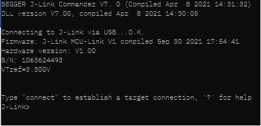
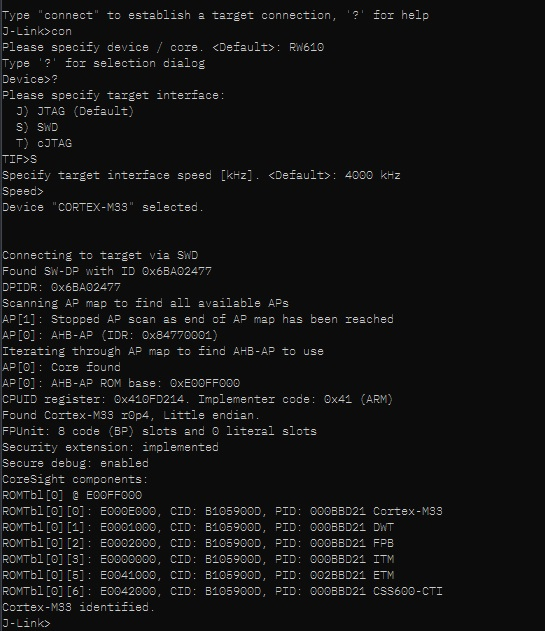

# OpenThread on NXP RW612 Example

This directory contains example platform drivers for the [NXP RW612] based on [RD-RW612-BGA] hardware platform, including all variants of devices.
The example platform drivers are intended to present the minimal code necessary to support OpenThread. As a result, the example platform drivers do not necessarily highlight the platform's full capabilities.

## Prerequisites

Before you start building the examples, you must download and install the toolchain and the tools required for flashing and debugging.

## Toolchain

OpenThread environment is suited to be run on a Linux-based OS (Ubuntu OS for example), WSL (Ubuntu 20.04 on Windows) or Windows (command line).
There are three tools that need to be installed:

- CMake
- ninja
- the arm-non-eabi gcc cross-compiler

Depending on system used installing each tool done differently.

### Linux-based

In a Bash terminal (found, for example, in Ubuntu OS), follow these instructions to install the GNU toolchain and other dependencies.

```bash
$ cd <path-to-ot-nxp>
$ ./script/bootstrap
```

### WSL (Ubuntu 20.05 on Windows)

Open the WSL console and type the following.

```bash
$ sudo apt install ninja-build cmake gcc-arm-none-eabi
```

### Windows

On this platform you have to install all the tools by downloading the installers:

- For the CMake get the downloader from the [official site](https://cmake.org) and install it
- For the ninja build system download the binary from the [official site](https://ninja-build.org). Place it in a path accessible from the windows command window.
- For the gcc-arm-non-eabi cross-compiler, download the installer from the [official site](https://developer.arm.com/downloads/-/gnu-rm) and install it

Make sure that the paths of all these tools are set into the `Path` system variable.

## Downloading the SDK

Download the NXP MCUXpresso git SDK and associated middleware from GitHub using the west tool:

```bash
$ cd <path-to-ot-nxp>/third_party/github_sdk/sdk_2.15.0
$ west init -l manifest --mf west.yml
$ west update
```

## Building the examples

- OT CLI application :

```bash
$ cd <path-to-ot-nxp>
$ git submodule update --init
$ ./script/build_rw612 ot_cli
```

- Border Router application with Wi-Fi:

```bash
$ cd <path-to-ot-nxp>
$ git submodule update --init
$ ./script/build_rw612 ot_br_wifi
```

- Border Router application with Ethernet:

```bash
$ cd <path-to-ot-nxp>
$ git submodule update --init
$ ./script/build_rw612 ot_br_eth
```

To build for a specific device revision such as A0:

```bash
$ cd <path-to-ot-nxp>
$ git submodule update --init
$ ./script/build_rw612 ot_cli -DOT_NXP_DEVICE_REVISION=A0
```

After a successful ot-cli build, the `elf` and `binary` files are found in `build_rw612/rw612_ot_cli/bin`:

- ot-cli-rw612 (the elf image)
- ot-cli-rw612.bin (the binary)

After a successful ot-br build, the `elf` and `binary` files are found in:
`build_rw612/rw612_ot_br_wifi/bin` : for Wi-Fi configuration
`build_rw612/rw612_ot_br_eth/bin` : for Ethernet configuration

- ot-br-rw612 (the elf image)
- ot-br-rw612.bin (the binary)

For border router features see dedicated [README][otbr-readme-page] file.

[otbr-readme-page]: ../../../examples/br/README-OTBR.md

## Flash Binaries

To flash the binaries we use the JLink from Segger. You can download it and install it from https://www.segger.com/products/debug-probes/j-link.
Once it is install to flash the images run JLink from the command line (either windows or linux):

```bash
$ JLink
```

You will be presented with a menu like:



Run the following commands:

```bash
J-Link> connect
Device> ? # you will be presented with a dialog -> select `CORTEX-M33`
Please specify target interface:
 J) JTAG (Default)
 S) SWD
 T) cJTAG
TIF> S
Specify target interface speed [kHz]. <Default>: 4000 kHz
Speed> # <enter>
```

If successfull you will see the following screen:



At this point flash the image with the following command

```bash
J-Link> loadbin path/to/binary,0x08000000
```

## Running the example

1. Prepare two boards with the flashed `CLI Example` (as shown above).
2. The CLI example uses UART connection. To view raw UART output, start a terminal emulator like PuTTY and connect to the used COM port with the following UART settings:

   - Baud rate: 115200
   - 8 data bits
   - 1 stop bit
   - No parity
   - No flow control

3. Open a terminal connection on the first board and start a new Thread network.

   Note that setting channel, panid, and network key is not enough anymore because of an Open Thread stack update.

   We first need to initialize a new dataset. Using `dataset` command we visualize the newly generated dataset.

```bash
> dataset init new
Done
> dataset
Active Timestamp: 1
Channel: 25
Channel Mask: 0x07fff800
Ext PAN ID: 42af793f623aab54
Mesh Local Prefix: fd6e:c358:7078:5a8d::/64
Network Key: f824658f79d8ca033fbb85ecc3ca91cc
Network Name: OpenThread-b870
PAN ID: 0xb870
PSKc: f438a194a5e968cc43cc4b3a6f560ca4
Security Policy: 672 onrc 0
Done
>
```

To change network parameters use:

```bash
> dataset panid 0xabcd
Done
> dataset channel 25
Done
```

Then commit the new dataset:

```bash
> dataset commit active
Done
> ifconfig up
Done
> thread start
Done
```

4. After a couple of seconds the node will become a Leader of the network.

```bash
> state
Leader
> dataset active -x
0e08000000000001000035060004001fffe0020842af793f623aab540708fd6ec35870785a8d0510f824658f79d8ca033fbb85ecc3ca91cc030f4f70656e5468726561642d623837300102b8700410f438a194a5e968cc43cc4b3a6f560ca40c0402a0f7f8000300000b
Done
>
```

5. Open a terminal connection on the second board and attach a node to the network.

```bash
> dataset set active 0e08000000000001000035060004001fffe0020842af793f623aab540708fd6ec35870785a8d0510f824658f79d8ca033fbb85ecc3ca91cc030f4f70656e5468726561642d623837300102b8700410f438a194a5e968cc43cc4b3a6f560ca40c0402a0f7f8000300000b
Done
> ifconfig up
Done
> thread start
Done
```

6. After a couple of seconds the second node will attach and become a Child.

```bash
> state
Child
```

7. List all IPv6 addresses of the first board.

```bash
> ipaddr
fdde:ad00:beef:0:0:ff:fe00:fc00
fdde:ad00:beef:0:0:ff:fe00:9c00
fdde:ad00:beef:0:4bcb:73a5:7c28:318e
fe80:0:0:0:5c91:c61:b67c:271c
```

8. Choose one of them and send an ICMPv6 ping from the second board.

```bash
> ping fdde:ad00:beef:0:0:ff:fe00:fc00
16 bytes from fdde:ad00:beef:0:0:ff:fe00:fc00: icmp_seq=1 hlim=64 time=8ms
```

For a list of all available commands, visit [OpenThread CLI Reference README.md][cli].

[cli]: https://github.com/openthread/openthread/blob/main/src/cli/README.md
